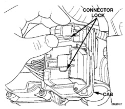
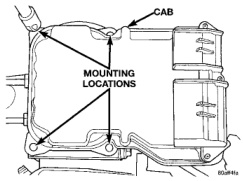
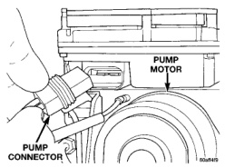

# BRAKES 5-54

## REMOVAL AND INSTALLATION

### CONTROLLER ANTILOCK BRAKES

> **NOTE:** If the CAB needs to be replaced, the rear axle type and tire revolutions per mile must be programed into the new CAB. For axle type refer to Group 3 Differential and Driveline. For tire revolutions per mile refer to Group 22 Tire and Wheels. To program the CAB refer to the Chassis Diagnostic Manual.

**REMOVAL**

1. Disconnect battery negative cable.

2. Push the harness connector locks to release the locks, (Fig. 3) then remove the connectors from the CAB.

3. Disconnect the pump motor connector (Fig. 4).

4. Remove screws attaching CAB to the HCU (Fig. 5).

5. Remove the CAB.

*Fig. 4 Harness Connector Locks*
- Connector Lock
- CAB

*Fig. 5 Pump Motor Connector*
- Pump Motor
- Pump Connector

*Fig. 3 Controller Mounting Screws*
- CAB
- Mounting Locations

**INSTALLATION**

1. Place the CAB onto the HCU.

> **NOTE:** Insure the CAB seal is in position before installation.

2. Install the mounting screws and tighten to 4-4.7 N·m (36-42 in. lbs.).

3. Connect the pump motor harness.

4. Connect the harnesses to the CAB and lock the connectors.

5. Connect battery.

### ANTILOCK CONTROL ASSEMBLY

> **NOTE:** If the antilock control assembly needs to be replaced, the rear axle type and tire revolutions per mile must be programed into the new CAB. For axle type refer to Group 3 Differential and Driveline. For tire revolutions per mile refer to Group 22 Tire and Wheels. To program the CAB refer to the Chassis Diagnostic Manual.

**REMOVAL**

1. Disconnect battery negative cable.

2. Push the harness connector locks to release the locks, (Fig. 3) then remove the connectors from the CAB.

3. Disconnect brake lines from HCU (Fig. 6).

4. Remove the two mounting bolts on either side of the assembly which attach the assembly to the mounting bracket.

5. Tilt the assembly upward were the brake lines attach and remove the assembly from the mounting bracket.
