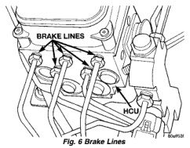
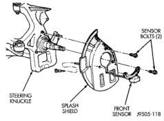
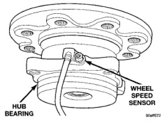

# BRAKES 5-55

## REMOVAL AND INSTALLATION (Continued)

*Fig. 7 Brake Lines*
- Brake Lines
- HCU

**INSTALLATION**

1. Install the assembly into the mounting bracket.

2. Install the mounting bolts and tighten to 12 N·m (102 in. lbs.).

3. Connect the CAB harnesses.

4. Connect the brake lines to the HCU. Tighten brake line fittings to 19-23 N·m (170-200 in. lbs.).

5. Connect battery.

6. Bleed brake system.

---

### FRONT WHEEL SPEED SENSOR - 2WD

**REMOVAL**

1. Raise vehicle and support vehicle front end.

2. Remove wheel and tire assembly.

3. Disconnect the ABS wheel speed sensor wire from under the hood. Remove sensor wire from the frame and steering knuckle.

4. Remove brake caliper.

5. Remove rotor.

6. Remove bolts attaching sensor to steering knuckle and remove the sensor (Fig. 7).

*Fig. 8 Front Speed Sensor Mounting - 2WD*
- Steering Knuckle
- Splash Shield
- Front Sensor
- Sensor Bolts (2)

**INSTALLATION**

1. Position sensor in knuckle.

2. Install and tighten sensor bolts to 23 N·m (17 ft. lbs.). **Use original or replacement sensor bolts only. The bolts are special and must not be substituted.**

3. Install sensor wire to the steering knuckle and frame. Connect the wheel speed sensor wire under the hood.

4. Check sensor wire routing. Be sure wire is clear of all chassis components and is not twisted or kinked at any spot.

5. Install rotor and brake caliper.

6. Install wheel and tire assembly.

7. Remove support and lower the vehicle.

8. Apply brakes several times to seat brake shoes and caliper piston. Do not move vehicle until firm brake pedal is obtained.

9. Verify sensor operation with scan tool.

---

### FRONT WHEEL SPEED SENSOR - 4WD

**REMOVAL**

1. Raise and support vehicle.

2. Remove wheel and tire assembly.

3. Disconnect the ABS wheel speed sensor wire from under the hood. Remove sensor wire from the frame and steering knuckle.

4. Remove brake caliper.

5. Remove rotor on models with 5 wheel studs. On models with 8 studs remove rotor hub bearing assembly and separate the rotor from the hub bearing.

6. Remove bolt attaching sensor to the hub bearing (Fig. 8).

7. Remove sensor and wire.

*Fig. 9 Wheel Speed Sensor*
- Hub Bearing
- Wheel Speed Sensor

**INSTALLATION**

1. Install the sensor in the hub bearing and tighten the bolt to 14 N·m (11 ft. lbs.). **Use original or replacement sensor bolts only. The bolts are special and must not be substituted.**
