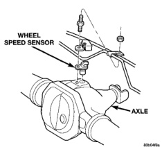
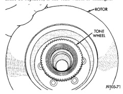

# BRAKES 5-56

## REMOVAL AND INSTALLATION (Continued)

2. Install the rotor on models with 5 wheel studs. On models with 8 studs install the rotor on the hub bearing and install the assembly on the knuckle.

3. Install sensor wire to the steering knuckle and frame. Connect the wheel speed sensor wire under the hood.

4. Check sensor wire routing. Be sure wire is clear of all chassis components and is not twisted or kinked at any spot.

5. Install brake caliper.

6. Install wheel and tire assemblies.

7. Remove support and lower the vehicle.

8. Apply brakes several times to seat brake shoes and caliper piston. Do not move vehicle until firm brake pedal is obtained.

9. Verify sensor operation with scan tool.

### TONE WHEEL

The tone wheel for the front speed sensor is located in the rotor hub on 2-wheel drive models (Fig. 9). On 4-wheel drive models, the tone wheel is located in the hub/bearing housing.

The tone wheel is not a serviceable component. On 2-wheel drive models, the complete rotor and hub assembly will have to be replaced if the tone wheel is damaged. On 4-wheel drive models, the hub/bearing must be replaced, if the tone wheel is damaged.

*Fig. 9 Tone Wheel 2WD*
- Rotor
- Tone Wheel

---

### REAR WHEEL SPEED SENSOR

**REMOVAL**

1. Raise vehicle on hoist.

2. Remove brake line mounting nut and remove the brake line from the sensor stud.

3. Remove mounting stud from the sensor and shield (Fig. 10).

4. Remove sensor and shield from differential housing.

*Fig. 10 Rear Speed Sensor Mounting*
- Wheel Speed Sensor
- Axle

5. Disconnect sensor wire harness and remove sensor.

**INSTALLATION**

1. Connect harness to sensor. **Be sure seal is securely in place between sensor and wiring connector.**

2. Install O-ring on sensor (if removed).

3. Insert sensor in differential housing.

4. Install sensor shield.

5. Install the sensor mounting stud and tighten to 24 N·m (18 ft. lbs.).

6. Install the brake line on the sensor stud and install the nut.

7. Lower vehicle.

### EXCITER RING

The exciter ring is mounted on the differential case. If the ring is damaged refer to Group 3 Differential and Driveline for service procedures.

---

## SPECIFICATIONS

### TORQUE CHART

| DESCRIPTION | TORQUE |
|-------------|--------|
| **ABS Assembly** | |
| Bracket Bolts | 10-16 N·m (120-144 in. lbs.) |
| Mounting Nuts | 12 N·m (102 in. lbs.) |
| CAB Screws | 4-4.7 N·m (36-42 in. lbs.) |
| Brake Lines | 19-23 N·m (170-200 in. lbs.) |
| **Wheel Speed Sensor** | |
| Ft. Bolts (2WD) | 23 N·m (17 ft. lbs.) |
| Ft. Bolt (4WD) | 14 N·m (11 ft. lbs.) |
| Rear Bolt | 24 N·m (18 ft. lbs.) |
