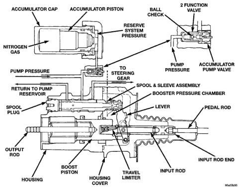
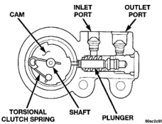

# BRAKES 5-5

## DESCRIPTION AND OPERATION (Continued)

allows normal fluid flow during moderate braking. The valve only controls fluid flow during high deceleration brake stops, when a percentage of rear weight is transferred to the front wheels.

*Fig. 2 Hydraulic Brake Booster*
- Accumulator Cap
- Accumulator Piston
- Ball Check
- 2 Function Valve
- Reserve System Pressure
- Nitrogen Gas
- Pump Pressure
- To Steering Gear
- Pump Pressure
- Accumulator Pump Valve
- Return To Pump Reservoir
- Spool & Sleeve Assembly
- Booster Pressure Chamber
- Spool Plug
- Lever
- Pedal Rod
- Output Rod
- Input Rod End
- Boost Piston
- Input Rod
- Housing
- Housing Cover
- Travel Limiter

### HEIGHT SENSING PROPORTIONING VALVE

The Height Sensing Proportioning Valve provides two different brake balance modes to the rear brake based on the vehicle load. This is accomplished by turning the valve on or off. When the vehicle is not loaded hydraulic pressure is reduced to the rear brakes after the split point. When the vehicle is carrying a full load the actuator lever moves up to change the valve setting. The valve now allows full hydraulic pressure to the rear brake. The valve contains a plunger, cam, torsional clutch spring and actuator shaft (Fig. 3). This valve is used on all 4WD 2500 vehicles with 8,800 GVW.

The valve is mounted to the left frame rail above the rear axle. The valve has an actuator lever connected by a link to the left lower shock bracket. The valve is turned on and off as the axle to frame height changes due to the load in the vehicle. A torsional clutch spring attached to the valve shaft and cam is used as an override feature. Once the valve is posi-

*Fig. 3 Height Sensing Proportioning Valve*
- Cam
- Inlet Port
- Outlet Port
- Torsional Clutch Spring
- Shaft
- Plunger
