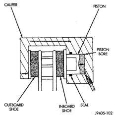
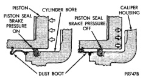

# BRAKES 5-6

## DESCRIPTION AND OPERATION (Continued)

tioned during brake application, the spring prevents the valve from changing position in the event of an abrupt suspension movement such as going over a bump. During this instance the cam is held in position while the shaft is allowed to rotate.

> **CAUTION:** If the valve assembly is replaced for service, the lever must not be adjusted, it is preset at the factory. The Height Sensing Proportioning Valve is service as an assembly only.

### FRONT DISC BRAKES

The calipers are a single piston type. The calipers are free to slide laterally, this allows continuous compensation for lining wear.

When the brakes are applied fluid pressure is exerted against the caliper piston. The fluid pressure is exerted equally and in all directions. This means pressure exerted against the caliper piston and within the caliper bore will be equal (Fig. 4).

*Fig. 4 Brake Caliper Operation*
- Caliper
- Piston
- Piston Bore
- Outboard Shoe
- Inboard Shoe
- Seal

Fluid pressure applied to the piston is transmitted directly to the inboard brake shoe. This forces the shoe lining against the inner surface of the disc brake rotor. At the same time, fluid pressure within the piston bore forces the caliper to slide inward on the mounting bolts. This action brings the outboard brake shoe lining into contact with the outer surface of the disc brake rotor.

In summary, fluid pressure acting simultaneously on both piston and caliper, produces a strong clamping action. When sufficient force is applied, friction will stop the rotors from turning and bring the vehicle to a stop.

Application and release of the brake pedal generates only a very slight movement of the caliper and piston. Upon release of the pedal, the caliper and piston return to a rest position. The brake shoes do not retract an appreciable distance from the rotor. In fact, clearance is usually at, or close to zero. The reasons for this are to keep road debris from getting between the rotor and lining and in wiping the rotor surface clear each revolution.

The caliper piston seal controls the amount of piston extension needed to compensate for normal lining wear.

During brake application, the seal is deflected outward by fluid pressure and piston movement (Fig. 5). When the brakes (and fluid pressure) are released, the seal relaxes and retracts the piston.

The amount of piston retraction is determined by brake lining wear. Generally the amount is just enough to maintain contact between the piston and inboard brake shoe.

*Fig. 5 Lining Wear Compensation By Piston Seal*
- Piston
- Cylinder Bore
- Caliper Housing
- Piston Seal Brake Pressure On
- Piston Seal Brake Pressure Off
- Dust Boot

### DRUM BRAKES

All models are equipped with rear drum brake assemblies. They are two-shoe, duo-servo units with an automatic adjuster mechanism.

Three different size drum brake assemblies are used:

- 1/2 ton (1500) models: 11 x 2 in.
- 3/4 ton (2500) models: 13 x 2.5 in.
- 1 ton (3500) models: 13 x 3.5 in.

Two different wheel cylinders are used. The difference being cylinder bore size. The cylinders used on 1/2 and 3/4 ton models have a bore diameter of 23.8 mm (0.937 or 15/16 in.). The cylinders used on 1 ton models have a bore diameter of 27 mm (1.06 or 1-1/16 in.).

The drum brakes are a semi-floating, self-energizing, servo action design. The brake shoes are not fixed on the support plate. This type of brake allows the shoes to pivot and move vertically to a certain extent.
