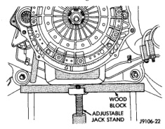
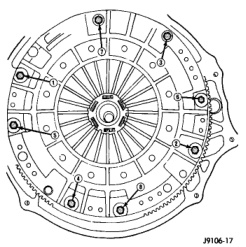
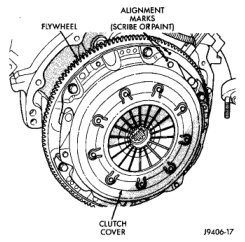

## REMOVAL AND INSTALLATION

### CLUTCH COVER AND DISC

#### REMOVAL

(1) Raise and support vehicle.

(2) Support engine with wood block and adjustable jack stand (Fig. 18). Supporting engine is necessary to avoid undue strain on engine mounts.

*Fig. 18 Supporting Engine With Jack Stand And Wood Block—Diesel Model Shown*

(3) Remove transmission and transfer case, if equipped. Refer to Group 21, Transmission and Transfer Case, for proper procedures.

(4) If clutch cover will be reused, mark position of cover on flywheel with paint or scriber (Fig. 19).

*Fig. 19 Marking Clutch Cover Position*

(5) Insert clutch alignment tool in clutch disc and into pilot bushing. Tool will hold disc in place when cover bolts are removed.

(6) If clutch cover will be reused, loosen cover bolts evenly, only few threads at a time, and in a diagonal pattern (Fig. 20). This relieves cover spring tension evenly to avoid warping.

*Fig. 20 Clutch Cover Bolt Loosening/Tightening Pattern*

(7) Remove cover bolts completely and remove cover, disc and alignment tool.

#### INSTALLATION

(1) Check runout and free operation of new clutch disc.

(2) Lubricate crankshaft pilot bearing with Mopar high temperature bearing grease.

(3) Insert clutch alignment tool in clutch disc hub.

(4) Verify that disc hub is positioned correctly. The raised side of hub is installed away from the flywheel.
