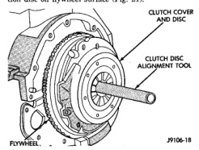
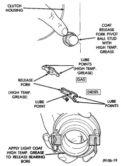
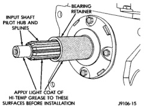

## REMOVAL AND INSTALLATION (Continued)

(5) Insert alignment tool in pilot bearing and position disc on flywheel surface (Fig. 21).

*Fig. 21 Clutch Disc And Cover Alignment/Installation*

(6) Position clutch cover over disc and onto flywheel (Fig. 21).

(7) Align and hold clutch cover in position and install cover bolts finger tight.

(8) Tighten cover bolts evenly and a few threads at a time. Cover bolts must be tightened evenly and to specified torque to avoid distorting cover.

(9) Tighten clutch cover bolts to following:
- 5/16 in. diameter bolts to 23 N·m (17 ft. lbs.).
- 3/8 in. diameter bolts to 41 N·m (30 ft. lbs.).

(10) Remove release lever and release bearing from clutch housing. Apply Mopar high temperature bearing grease to bore of release bearing, release lever contact surfaces and release lever pivot stud (Fig. 22).

(11) Apply light coat of Mopar high temperature bearing grease to splines of transmission input shaft (or drive gear) and to release bearing slide surface of the transmission front bearing retainer (Fig. 23). Do not over lubricate shaft splines. This can result in grease contamination of disc.

*Fig. 22 Clutch Release Component Lubrication Points*

*Fig. 23 Input Shaft Lubrication Points—Typical*
