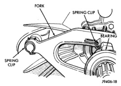
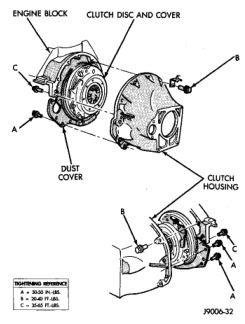
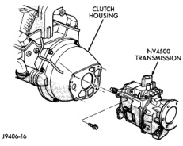

## REMOVAL AND INSTALLATION (Continued)

(12) Install release lever and bearing in clutch housing. Be sure spring clips that retain fork on pivot ball and release bearing on fork are properly installed (Fig. 24).

*Fig. 24 Release Fork And Bearing Spring Clip Position*

(13) Install transmission. Refer to Group 21, Transmission and Transfer Case, for proper procedures.

(14) Check fluid level in clutch master cylinder.

### CLUTCH HOUSING—NV4500

#### REMOVAL

(1) Raise and support vehicle.

(2) Remove transmission and transfer case, if equipped. Refer to Group 21, Transmission and Transfer Case, for proper procedures.

(3) Remove clutch housing bolts and remove housing from engine (Fig. 25) and (Fig. 26).

*Fig. 25 Transmission/Clutch Housing—NV4500*

*Fig. 26 Clutch Housing Installation—NV4500*

#### INSTALLATION

(1) Clean housing mounting surface of engine block with wax and grease remover.

(2) Verify that clutch housing alignment dowels are in good condition and properly seated.

(3) Transfer slave cylinder, release fork and boot, fork pivot stud, and wire/hose brackets to new housing.

(4) Lubricate release fork and pivot contact surfaces with Mopar High Temperature wheel bearing grease before installation.

(5) Align and install clutch housing on transmission. Tighten housing bolts closest to alignment dowels first and to torque values indicated (Fig. 25) and (Fig. 26).

(6) Install transmission-to-engine strut after installing clutch housing. Tighten bolt attaching strut to clutch housing first and engine bolt last.

(7) Install transmission and transfer case, if equipped. Refer to Group 21, Transmission and Transfer Case, for proper procedures.

### CLUTCH LINKAGE

The clutch master cylinder, remote reservoir, slave cylinder and connecting lines are all serviced as an assembly. These components cannot be serviced separately. The linkage cylinders and connecting lines
