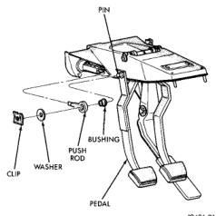
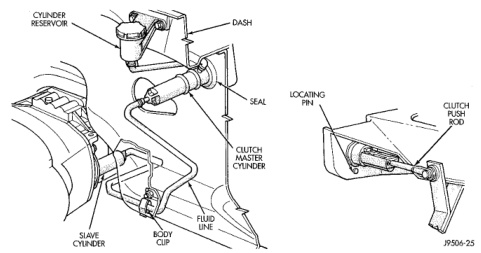

## REMOVAL AND INSTALLATION (Continued)

are sealed units. They are pre-filled with fluid during manufacture and must not be disassembled nor disconnected.

#### REMOVAL

(1) Raise and support vehicle.

(2) On diesel models, remove slave cylinder shield from clutch housing, if equipped.

(3) Remove nuts attaching slave cylinder to studs on clutch housing.

(4) Remove slave cylinder from clutch housing.

(5) Disengage slave cylinder fluid line from body retainer clips.

(6) Lower vehicle.

(7) Disconnect clutch pedal interlock switch wires.

(8) Remove locating clip from clutch master cylinder mounting bracket (Fig. 27).

(9) Remove retaining clip, flat washer and wave washer that attach clutch master cylinder push rod to clutch pedal (Fig. 28).

(10) Slide clutch master cylinder push rod off pedal pin.

(11) Inspect condition of bushing on clutch pedal pin (Fig. 28). Remove and replace bushing if worn or damaged.

(12) Verify that cap on clutch master cylinder reservoir is tight. This will avoid spillage during removal.

(13) Remove screws that attach clutch fluid reservoir to dash panel.

(14) Remove reservoir mounting bracket screws and remove reservoir from dash panel.

*Fig. 27 Clutch Hydraulic Linkage*

*Fig. 28 Clutch Cylinder Push Rod Attachment*

(15) Rotate clutch master cylinder 45° counterclockwise to unlock it. Then remove cylinder from dash panel.

(16) Remove clutch master cylinder rubber seal from dash panel (Fig. 27).

(17) Remove clutch cylinders, reservoir and connecting lines from vehicle.
