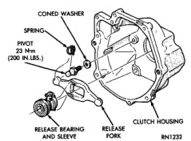
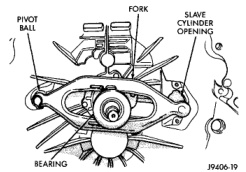

## REMOVAL AND INSTALLATION (Continued)

#### INSTALLATION

(1) Tighten cap on clutch fluid reservoir to avoid spillage during installation.

(2) Position cylinders, connecting lines and reservoir in vehicle engine compartment.

(3) Lubricate cylinder seal with liquid dish soap to ease installation. Then seat seal in dash and around cylinder.

(4) Insert clutch master cylinder in dash panel. Rotate cylinder 45° clockwise to lock it in place.

(5) If cylinder seal is hard to seat, unlock cylinder and reseat seal if necessary. Then lock cylinder afterward.

(6) Position clutch fluid reservoir on dash panel and install reservoir screws. Tighten screws to 5 N·m (40 in. lbs.) torque.

(7) Install reservoir mounting bracket on dash panel, if removed.

(8) Apply a light coating of grease to the inside and outside diameter of the master cylinder bushing.

(9) Install bushing on clutch pedal pin.

(10) Install clutch master cylinder push rod on clutch pedal pin. Secure rod with wave washer, flat washer and retainer ring.

(11) Connect clutch pedal position (interlock) switch wires.

(12) Install locating clip in clutch master cylinder mounting bracket.

(13) Raise vehicle.

(14) Install slave cylinder. Be sure cap at end of cylinder rod is seated in release lever. Check this before installing cylinder attaching nuts.

(15) Install and tighten slave cylinder attaching nuts to 23 N·m (200 in. lbs.) torque.

(16) Lower vehicle.

(17) If new linkage has been installed, remove plastic shipping stop from master cylinder push rod. Do this after installing slave cylinder and before operating linkage.

(18) Operate linkage several times to verify proper operation.

### RELEASE BEARING

#### REMOVAL

(1) Remove transmission and transfer case, if equipped. Refer to Group 21, Transmission and Transfer Case, for proper procedures.

(2) On models with gas engine and new style release fork, remove clutch housing for access to release fork and release bearing retainer springs.

(3) Disconnect release bearing from release fork and remove bearing (Fig. 29).

*Fig. 29 Clutch Release Components*

#### INSTALLATION

(1) Inspect bearing slide surface on transmission front bearing retainer. Replace retainer if slide surface is scored, worn, or cracked.

(2) Inspect release lever and pivot stud. Be sure stud is secure and in good condition. Be sure fork is not distorted or worn. Replace fork spring clips if bent or damaged.

(3) Lubricate crankshaft pilot bearing, input shaft splines, bearing retainer slide surface, lever pivot ball stud and release lever pivot surface with Mopar high temperature bearing grease.

(4) Install release fork and release bearing (Fig. 30). Be sure fork and bearing are properly secured by spring clips.

*Fig. 30 Clutch Release Fork And Bearing Installation*

(5) Install clutch housing, if removed.

(6) Install transmission and transfer case, if equipped. Refer to Group 21, Transmission and Transfer Case, for proper procedures.
