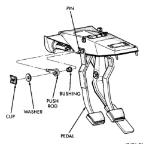
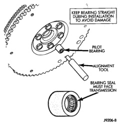
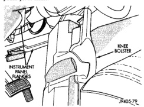

## REMOVAL AND INSTALLATION (Continued)

### PILOT BEARING

#### REMOVAL

(1) Remove transmission, transfer case, if equipped, and clutch housing. Refer to Group 21, Transmission and Transfer Case, for proper procedures.

(2) Remove clutch cover and disc.

(3) Using a suitable blind hole puller, remove pilot bearing.

#### INSTALLATION

(1) Clean bearing bore with solvent and wipe dry with shop towel.

(2) Install new bearing with clutch alignment tool (Fig. 31). Keep bearing straight during installation. Do not allow bearing to become cocked. Tap bearing into place until flush with edge of bearing bore. Do not recess bearing.

*Fig. 31 Typical Method Of Installing Pilot Bearing*

(3) Lubricate bearing with Mopar high temperature grease, or an equivalent quality grease.

(4) Install clutch cover and disc.

(5) Install clutch housing, transmission and transfer case, if equipped. Refer to Group 21, Transmission and Transfer Case, for proper procedures.

### CLUTCH PEDAL

#### REMOVAL

(1) Remove retaining ring, flat washer and wave washer that secure brake and clutch pedals to push rods (Fig. 32).

*Fig. 32 Clutch Cylinder Push Rod Attachment*

(2) Remove knee bolster (Fig. 33) for access to pedal pivot shaft.

*Fig. 33 Knee Bolster Removal*

(3) Remove brake light switch. Turn switch clockwise about 30° to release it then remove switch from bracket.

(4) Remove retainer from passenger side of pedal pivot shaft (Fig. 34).

(5) Push pedal pivot shaft toward driver side of support only enough to remove clutch pedal. It is not necessary to remove shaft from pedal support entirely.

(6) Remove clutch pedal.
