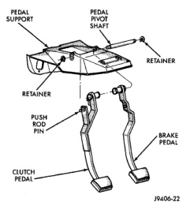
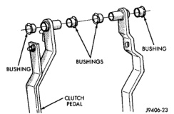

## REMOVAL AND INSTALLATION (Continued)

*Fig. 34 Clutch/Brake Pedal Mounting*

#### INSTALLATION

(1) Inspect bushings in clutch and brake pedals (Fig. 35). Replace bushings if worn, cracked, or distorted.

(2) Lubricate pedal shaft, pedal shaft bore (Fig. 34) and (Fig. 35) and all bushings with Mopar Multi Mileage, or high temperature bearing grease.

(3) Position clutch pedal in support. Align pedal with pivot shaft and slide shaft through pedal bushings. Then repeat process for brake pedal.

(4) Slide pedal shaft through support and install shaft retainer.

(5) Secure push rods to clutch and brake pedals.

(6) Install brake light switch in bracket. Rotate switch into place to lock it in bracket.

(7) Install knee bolster.

*Fig. 35 Clutch/Brake Pedal Bushings*

## SPECIFICATIONS

### TORQUE

| Description | Torque |
|-------------|--------|
| Nut, slave cylinder | 19-26 N·m (170-230 in. lbs.) |
| Bolt, clutch cover—5/16 in. | 23 N·m (17 ft. lbs.) |
| Bolt, clutch cover—3/8 in. | 41 N·m (30 ft. lbs.) |
| Pivot, release bearing | 23 N·m (17 ft. lbs.) |
| Bolt, housing to engine—3/8 in. | 45 N·m (33 ft. lbs.) |
| Bolt, housing to engine—7/16 in. | 68 N·m (50 ft. lbs.) |
| Bolt, housing to engine—V-10 | 47 N·m (35 ft. lbs.) |
| Screw, fluid reservoir | 5 N·m (40 in. lbs.) |
