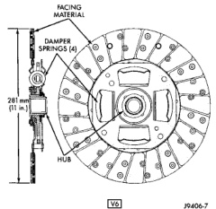

# CLUTCH

## CONTENTS

| Topic | Page |
|-------|------|
| **GENERAL INFORMATION** | |
| Clutch Components | 1 |
| Clutch Cover Application | 2 |
| Clutch Disc Application | 1 |
| Clutch Hydraulic Fluid | 3 |
| Clutch Hydraulic Linkage | 3 |
| Clutch Lubrication | 3 |
| Clutch Pedal Position Switch | 4 |
| General Information | 4 |
| Improper Clutch Release or Engagement | 4 |
| Misalignment | 8 |
| **DIAGNOSIS AND TESTING** | |
| NV4500 Clutch Housing | 6 |
| Clutch Contamination | 4 |
| Clutch Runout | 4 |
| Diagnostic Charts | 9 |
| **REMOVAL AND INSTALLATION** | |
| Clutch Cover and Disc | 11 |
| Clutch Housing—NV4500 | 13 |
| Clutch Linkage | 13 |
| Clutch Pedal | 16 |
| Pilot Bearing | 16 |
| Release Bearing | 15 |
| **SPECIFICATIONS** | |
| Torque | 17 |

## GENERAL INFORMATION

### CLUTCH COMPONENTS

The clutch mechanism in BR models with a gas or diesel engine consists of a single, dry-type clutch disc and a diaphragm style clutch cover. A hydraulic linkage is used to engage/disengage the clutch disc and cover.

The transmission input shaft is supported in the crankshaft by a bearing. A sleeve type release bearing is used to engage and disengage the clutch cover pressure plate.

The release bearing is operated by a release fork in the clutch housing. The fork pivots on a ball stud mounted inside the housing. The release fork is actuated by a hydraulic slave cylinder mounted in the housing. The slave cylinder is operated by a clutch master cylinder mounted on the dash panel. The cylinder push rod is connected to the clutch pedal.

The clutch disc has damper springs in the disc hub. The clutch disc facing is riveted to the hub. The facing is made from a non-asbestos material. The clutch cover pressure plate is a diaphragm type with a one-piece spring and multiple release fingers. The pressure plate release fingers are preset during manufacture and are not adjustable.

### CLUTCH DISC APPLICATION

Two clutch disc diameters and four different thicknesses are used.

A 281 mm (11 in.) diameter clutch disc is used with a 3.9L, 5.2L, or 5.9L gas engines (Fig. 1) and (Fig. 2).

*Fig. 1 Clutch Disc—V6 Engine*
