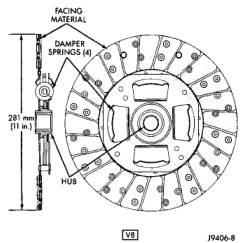
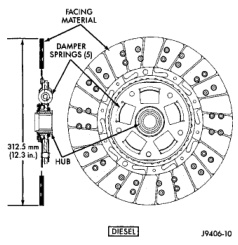
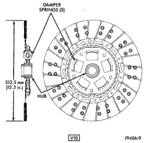
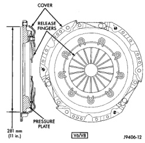

## GENERAL INFORMATION (Continued)

A 312.5 mm (12.3 in.) diameter clutch disc is used

*Fig. 2 Clutch Disc—V8 Engine*

with diesel and V10 engines (Fig. 3) and (Fig. 4).

*Fig. 3 Clutch Disc—V10 Engine*

All the discs have damper springs in the hub. The 281 mm discs have four springs while the 312.5 mm disc has five springs. The damper springs provide smoother torque transfer and disc engagement.

*Fig. 4 Clutch Disc—Diesel Engine*

### CLUTCH COVER APPLICATION

Two clutch covers are used for all applications. The 281 mm cover (Fig. 5) is used for 3.9L, 5.2L and 5.9L gas engine applications.

*Fig. 5 Clutch Cover—V6/V8 Gas Engine*

The 312.5 mm cover (Fig. 6), is used for 5.9L diesel and V10 gas engine applications.
