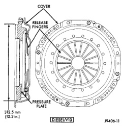

## GENERAL INFORMATION (Continued)

### CLUTCH HYDRAULIC LINKAGE

The hydraulic linkage consists of a remote reservoir, clutch master cylinder, clutch slave cylinder and interconnecting fluid lines (Fig. 7).

*Fig. 7 Clutch Hydraulic Linkage*

The clutch master cylinder is connected to the clutch pedal and the slave cylinder is connected to the clutch release fork. The master cylinder is mounted on the drivers' side of the dash panel adjacent to the brake master cylinder.

### CLUTCH HYDRAULIC FLUID

The clutch hydraulic linkage cylinders and lines are prefilled with fluid at the factory.

The hydraulic system should not require additional fluid under normal circumstances. In fact, the reservoir fluid level will actually increase as normal clutch wear occurs. For this reason, it is important to avoid overfilling, or removing fluid from the reservoir. This action will cause clutch release problems.

If inspection or diagnosis indicates additional fluid may be needed, it will be necessary to replace the complete hydraulic linkage assembly.

### CLUTCH LUBRICATION

Proper clutch component lubrication is important to satisfactory operation. Using the correct lubricant and avoiding over lubrication are also equally important.

During service, apply recommended lubricant sparingly. Do not overlubricate as this could result in clutch disc and pressure plate contamination.

Clutch and transmission components requiring lubrication are:
- pilot bearing.
- release lever pivot ball stud.
- release lever pivot surfaces.
- release bearing bore.
- clutch pedal pivot bore and bushings.
- transmission input shaft splines and pilot hub.
- release bearing slide surface of front bearing retainer.
- master cylinder bushing at the clutch pedal.

**Do not apply grease to any part of the clutch cover or disc.**

Use Mopar multi-mileage grease or a silicone grease for the clutch pedal bushings and pivot shaft.

Use Mopar high temperature bearing grease or equivalent for the pilot bearing, release bearing bore, transmission input shaft and release fork components. Apply recommended amounts only and do not overlubricate.
