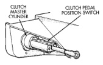

## GENERAL INFORMATION (Continued)

### CLUTCH PEDAL POSITION SWITCH

All BR models are equipped with a clutch pedal position switch (Fig. 8). The switch is in circuit with the starter relay and is mounted on the clutch master cylinder push rod. The switch is actuated by clutch pedal movement. The clutch pedal must be fully depressed in order to start the engine.

*Fig. 8 Clutch Pedal Position (Interlock) Switch*

The position switch is an integral part of the clutch master cylinder push rod and is not serviced separately.

Refer to Group 8W, Wiring Diagrams for component locations and circuit information.

## DIAGNOSIS AND TESTING

### GENERAL INFORMATION

Problem diagnosis will generally require a road test to determine the type of fault. Component inspection will then determine the problem cause after road testing.

Drive the vehicle at normal speeds during the road test. Shift the transmission through all gear ranges and observe clutch action.

If chatter, grab, slip, or improper release is experienced, remove and inspect the clutch components. However, if the problem is noise or hard shifting, further diagnosis may be needed. The transmission or another driveline component may actually be at fault. Careful observation during the test will help narrow the problem area.

### CLUTCH CONTAMINATION

Fluid contamination is a frequent cause of clutch malfunctions. Oil, grease, water, or other fluids on the clutch contact surfaces will cause faulty operation. The usual result is chatter, slip and grab.

During inspection, note if any components are contaminated. Look for evidence of oil, grease, clutch hydraulic fluid, or water/road splash on clutch components.

Oil contamination indicates a leak at either the rear main seal or transmission input shaft. Oil leaks produce a residue of oil on the housing interior and on the clutch cover and flywheel. Heat buildup caused by slippage between the clutch cover, disc, and flywheel can sometimes bake the oil residue onto the components. The glaze-like residue ranges in color from amber to black.

Road splash contamination means dirt/water is entering the clutch housing. This may be due to loose bolts, housing cracks, or through the slave cylinder opening. Driving through deep water puddles can force water/road splash into the housing through such openings.

Clutch fluid leaks are from loose or damaged clutch linkage fluid lines or connections. However, most clutch fluid leaks will usually be noted and corrected before severe contamination occurs.

Grease contamination is usually a product of excessive lubrication during clutch service. Apply only a small amount of grease to the input shaft splines, bearing retainer, pilot bearing, release fork and pivot stud. Excess grease can be thrown off during operation and contaminate the disc.

### IMPROPER CLUTCH RELEASE OR ENGAGEMENT

Clutch release or engagement problems are caused by wear, or damage to one or more clutch components. A visual inspection of the release components will usually reveal the problem part.

Release problems can result in hard shifting and noise. Items to look for are: leaks at the clutch cylinders and interconnecting line; loose slave cylinder bolts; worn/loose release fork and pivot stud; damaged release bearing; and a worn clutch disc, or pressure plate.

Normal condensation in vehicles that are stored or out of service for long periods of time can generate enough corrosion to make the disc stick to the flywheel, or pressure plate. If this condition is experienced, correction only requires that the disc be loosened manually through the inspection plate opening.

Engagement problems usually result in slip, chatter/shudder, and noisy operation. The primary causes are clutch disc contamination; clutch disc wear; misalignment, or distortion; flywheel damage; or a combination of the foregoing. A visual inspection is required to determine the part actually causing the problem.

### CLUTCH RUNOUT

#### CLUTCH DISC

Check the clutch disc before installation. Axial (face) runout of a new disc should not exceed 0.5 mm (0.020 in.). Measure runout about 6 mm (1/4 in.) from the outer edge of the disc facing. Obtain another disc if runout is excessive.
