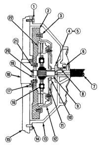

## DIAGNOSIS AND TESTING (Continued)

*Fig. 1*

*Clutch Components*

1. Check clutch housing bolts. Tighten if loose. Be sure housing is fully seated on engine block.

2. Check flywheel. Scuff sand face to remove glaze. Clean surface with wax and grease remover. Replace flywheel if severely scored, worn or cracked. Secure flywheel with new bolts (if removed). Do not reuse old bolts. Use Mopar Lock N'Seal on bolts.

3. Tighten clutch cover bolts 2-3 threads at a time, alternately and evenly (in a star pattern) to specified torque. Failure to do so could warp the cover.

4. Check release fork. Replace fork if bent or worn. Make sure pivot and bearing contact surfaces are lubricated.

5. Check release fork pivot (in housing). Be sure pivot is secure and ball end is lubricated.

6. Transmission input shaft bearing will cause noise, chatter, or improper release if damaged. Check condition before installing transmission.

7. Check slave cylinder. Replace it if leaking. Be sure cylinder is properly secured in housing and cylinder piston is seated in release fork.

8. Check input shaft seal if clutch cover and disc were oil covered. Replace seal if worn, or cut.

9. Inspect release bearing slide surface of trans. front bearing retainer. Surface should be smooth, free of nicks, scores. Replace retainer if necessary. Lubricate slide surface before installing release bearing.

10. Do not replace release bearing unless actually faulty. Replace bearing only if seized, noisy, or damaged.

11. Check clutch cover diaphragm spring and release fingers. Replace cover if spring or fingers are bent, warped, broken, cracked. Do not tamper with factory spring setting as clutch problems will result.

12. Check condition of clutch cover. Replace clutch cover if plate surface is deeply scored, warped, worn, or cracked. Be sure cover is correct size and properly aligned on disc and flywheel.

13. Inspect clutch housing. Be sure bolts are tight. Replace housing if damaged.

14. Verify that housing alignment dowels are in position before installing housing.

15. Clean engine block surface before installing clutch housing. Dirt, grime can produce misalignment.

16. Make sure side of clutch disc marked "flywheel side" is toward flywheel.

17. Check rear main seal if clutch disc and cover were oil covered. Replace seal if necessary.

18. Check crankshaft flange (if flywheel is removed). Be sure flange is clean and flywheel bolt threads are in good condition.

19. Check pilot bearing. Replace bearing if damaged. Lube with Mopar high temp. bearing grease before installation.

20. Check transmission input shaft. Disc must slide freely on shaft splines. Lightly grease splines before installation. Replace shaft if splines or pilot bearing hub are damaged.

21. Check flywheel bolt torque. If bolts are loose, replace them. Use Mopar Lock N'Seal to secure new bolts.

22. Check clutch disc facing. Replace disc if facing is charred, scored, flaking off, or worn. Also check runout of new disc. Runout should not exceed 0.5 mm (0.02 in.).
