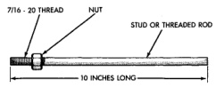
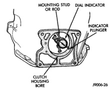

## DIAGNOSIS AND TESTING (Continued)

### CLUTCH COVER

Check condition of the clutch cover before installation. A warped cover or diaphragm spring will cause grab and incomplete release or engagement. Be careful when handling the cover and disc. Impact can distort the cover, diaphragm spring, release fingers and the hub of the clutch disc.

Use an alignment tool when positioning the disc on the flywheel. The tool prevents accidental misalignment which could result in cover distortion and disc damage.

A frequent cause of clutch cover distortion is improper bolt tightening. To avoid warping the cover, the bolts must be tightened in a diagonal pattern and only 2-3 threads at a time to the specified torque.

### FLYWHEEL

Flywheel runout should not exceed 0.08 mm (0.003 in.). Measure runout at the outer edge of the flywheel face with a dial indicator. Mount the indicator on a stud installed in place of one of the clutch housing bolts.

Common causes of runout are:
- heat warpage.
- improper machining.
- incorrect bolt tightening.
- improper seating on crankshaft flange shoulder.
- foreign material on crankshaft flange.

Flywheel machining is not recommended. The flywheel clutch surface is machined to a unique contour and machining will negate this feature. However, minor flywheel scoring can be cleaned up by hand with 180 grit emery, or with surface grinding equipment. Remove only enough material to reduce scoring (approximately 0.001 - 0.003 in.). Heavy stock removal is **not recommended**. Replace the flywheel if scoring is severe and deeper than 0.076 mm (0.003 in.). Excessive stock removal can result in flywheel cracking or warpage after installation; it can also weaken the flywheel and interfere with proper clutch release.

Clean the crankshaft flange before mounting the flywheel. Dirt and grease on the flange surface may cock the flywheel causing excessive runout. Use new bolts when remounting a flywheel and secure the bolts with Mopar Lock And Seal. Tighten flywheel bolts to specified torque only. Overtightening can distort the flywheel hub causing runout.

### NV4500 CLUTCH HOUSING

#### CHECKING RUNOUT

Only the NV4500 clutch housing can be checked using the following bore and face runout procedures. The NV3500 clutch housing is an integral part of the transmission front case and can only be checked off the vehicle.

#### MEASURING CLUTCH HOUSING BORE RUNOUT

(1) Remove the clutch housing and strut.

(2) Remove the clutch cover and disc.

(3) Replace one of the flywheel bolts with an appropriate size threaded rod that is 10 in. (25.4 cm) long (Fig. 9). The rod will be used to mount the dial indicator.

*Fig. 9 Dial Indicator Mounting Stud Or Rod*

(4) Remove the release fork from the clutch housing.

(5) Reinstall the clutch housing. Tighten the housing bolts nearest the alignment dowels first.

(6) Mount the dial indicator on the threaded rod and position the indicator plunger on the surface of the clutch housing bore (Fig. 10).

*Fig. 10 Checking Clutch Housing Bore Runout*

(7) Rotate the crankshaft until the indicator plunger is at the top center of the housing bore. Zero the indicator at this point.

(8) Rotate the crankshaft and record the indicator readings at eight points (45° apart) around the bore (Fig. 10). Repeat the measurement at least twice for accuracy.

(9) Subtract each reading from the one 180° opposite to determine magnitude and direction of runout. Refer to (Fig. 11) and following example.
