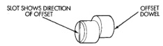
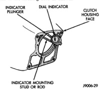

## DIAGNOSIS AND TESTING (Continued)

Bore runout example:
- 0.000 - (-0.007) = 0.007 in.
- +0.002 - (-0.010) = 0.012 in.
- +0.004 - (-0.005) = 0.009 in.
- -0.001 - (+0.001) = -0.002 in. (= 0.002 inch)

In the above example, the largest difference is 0.012 in. and is called the total indicator reading (TIR). This means that the housing bore is offset from the crankshaft centerline by 0.006 in. (which is 1/2 of 0.012 in.).

On gas engines, the acceptable maximum TIR for housing bore runout is 0.010 inch. If measured TIR is more than 0.010 in. (as in the example), bore runout will have to be corrected with offset dowels. Offset dowels are available in 0.007, 0.014 and 0.021 in. sizes for this purpose (Fig. 11). Refer to Correcting Housing Bore Runout for dowel installation.

*Fig. 11 Housing Bore Measurement Points And Sample Readings*

On diesel engines, the acceptable maximum TIR for housing bore runout is 0.015 inch. However, unlike gas engines, offset dowels are not available to correct runout on diesel engines. **If bore runout exceeds the stated maximum on a diesel engine, it may be necessary to replace either the clutch housing, or transmission adapter plate.**

#### Correcting Clutch Housing Bore Runout—Engine Only

On gas engine vehicles, clutch housing bore runout can be corrected with offset dowels.

The dial indicator reads positive when the plunger moves inward (toward indicator) and negative when it moves outward (away from indicator). As a result, the lowest or most negative reading determines the direction of housing bore offset (runout).

In the sample readings shown (Fig. 12) and in Step 7 above, the bore is offset toward the 0.010 inch reading. To correct this, remove the housing and original dowels. Then install the new offset dowels in the direction needed to center the bore with the crankshaft centerline.

In the example, TIR was 0.012 inch. The dowels needed for correction would have an offset of 0.007 in. (Fig. 12).

*Fig. 12 Housing Bore Alignment Dowel Selection*

**DOWEL SELECTION**

| TIR Value | Offset Dowel Required |
|-----------|----------------------|
| 0.011 - 0.021 inch | 0.007 inch |
| 0.022 - 0.035 inch | 0.014 inch |
| 0.036 - 0.052 inch | 0.021 inch |

Install the dowels with the slotted side facing out so they can be turned with a screwdriver. Then install the housing, remount the dial indicator and check bore runout again. Rotate the dowels until the TIR is less than 0.010 in. if necessary.

If a TIR of 0.053 in., or greater is encountered, it will be necessary to replace the clutch housing.

#### Measuring Clutch Housing Face Runout

(1) Reposition the dial indicator plunger on the housing face (Fig. 13). Place the indicator plunger at the rim of the housing bore as shown.

[Figure]

*Fig. 13 Measuring Clutch Housing Face Runout*

(2) Rotate the crankshaft until the indicator plunger is at the 10 O'clock position on the bore. Then zero the dial indicator.
