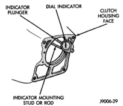

## DIAGNOSIS AND TESTING (Continued)

(3) Measure and record face runout at four points 90° apart around the housing face (Fig. 14). Perform the measurement at least twice for accuracy.

*Fig. 14 Housing Face Measurement Points And Sample Readings*

(4) Subtract the lowest reading from the highest to determine total runout. As an example, refer to the sample readings shown (Fig. 16). If the low reading was minus 0.004 in. and the highest reading was plus 0.009 in., total runout is actually 0.013 inch.

(5) Total allowable face runout is 0.010 inch. If runout exceeds this figure, runout will have to be corrected. Refer to Correcting Clutch Housing Face Runout.

#### CORRECTING CLUTCH HOUSING FACE RUNOUT

Housing face runout, on gas or diesel engines, can be corrected by installing shims between the clutch housing and transmission (Fig. 15). The shims can be made from shim stock or similar materials of the required thickness.

[Figure]

*Fig. 15 Housing Face Alignment Shims*

As an example, assume that face runout is the same as shown in (Fig. 16) and in Step 4. In this case, three shims will be needed. Shim thicknesses should be 0.009 in. (at the 0.000 corner), 0.012 in. (at the -0.003 corner) and 0.013 in. (at the -0.004 corner).

After installing the clutch assembly and housing, tighten the housing bolts nearest the alignment dowels first.

Clutch housing preferred bolt torques are:
- 41 N·m (30 ft. lbs.) for 3/8 in. diameter bolts
- 68 N·m (50 ft. lbs.) for 7/16 in. diameter bolts
- 47 N·m (35 ft. lbs.) for V10 and diesel clutch housing bolts

During final transmission installation, install the shims between the clutch housing and transmission at the appropriate bolt locations.

[Figure]

*Fig. 16 Measuring Clutch Housing Face Runout*

[Figure]

*Fig. 17 Housing Face Measurement Points And Sample Readings*

### MISALIGNMENT

Clutch housing alignment is important to proper clutch operation. The housing maintains alignment between the crankshaft and transmission input
