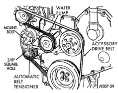
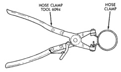

## DESCRIPTION AND OPERATION (Continued)

### WATER PUMPS—V-6, V-8, AND V-10 ENGINES

A centrifugal water pump circulates coolant through the water jackets, passages, intake manifold, radiator core, cooling system hoses and heater core. The pump is driven from the engine crankshaft by a drive belt.

The water pump impeller is pressed onto the rear of a shaft that rotates in a bearing pressed into the water pump body. The body has a small hole for ventilation. The water pump seals are lubricated by antifreeze in the coolant mixture. Additional lubrication is not necessary.

### WATER PUMP—5.9L DIESEL

The diesel engine water pump draws coolant from radiator outlet and circulates it through engine, heater core and back to radiator inlet. The crankshaft pulley drives the water pump with a serpentine drive belt (Fig. 22). An automatic belt tensioner (Fig. 22) is used to prevent the belt from slipping.

*Fig. 22 Water Pump—5.9L Diesel—Typical (non-A/C shown)*

### COOLING SYSTEM HOSES AND CLAMPS

Rubber hoses route coolant to and from the radiator, intake manifold and heater core. Radiator lower hoses are spring-reinforced to prevent collapse from water pump suction at moderate and high engine speeds.

Inspect the hoses at regular intervals. Replace hoses that are cracked, feel brittle when squeezed or swell excessively when system is pressurized. The use of molded replacement hoses is recommended. When performing a hose inspection, inspect radiator lower hose for proper position and condition of spring.

**WARNING: CONSTANT TENSION HOSE CLAMPS ARE USED ON MOST COOLING SYSTEM HOSES. WHEN REMOVING OR INSTALLING, USE ONLY TOOLS DESIGNED FOR SERVICING THIS TYPE OF CLAMP, SUCH AS SPECIAL CLAMP TOOL (NUMBER 6094) (Fig. 23). SNAP-ON CLAMP TOOL (NUMBER HPC-20) MAY BE USED FOR LARGER CLAMPS. ALWAYS WEAR SAFETY GLASSES WHEN SERVICING CONSTANT TENSION CLAMPS.**

**CAUTION: A number or letter is stamped into the tongue of constant tension clamps (Fig. 24). If replacement is necessary, use only an original equipment clamp with a matching number or letter.**

Ordinary worm gear type hose clamps (when equipped) can be removed with a straight screwdriver or a hex socket. **To prevent damage to hoses or clamps, the hose clamps should be tightened to 4 N·m (34 in. lbs.) torque. Do not over tighten hose clamps.**

For all vehicles: In areas where specific routing clamps are not provided, be sure that hoses are positioned with sufficient clearance. Check clearance from exhaust manifolds and pipe, fan blades, drive belts and sway bars. Improperly positioned hoses can be damaged, resulting in coolant loss and engine overheating.

*Fig. 23 Hose Clamp Tool—Typical*

### COOLANT RESERVE/OVERFLOW SYSTEM

The coolant reserve/overflow system works in conjunction with the radiator pressure cap. It utilizes thermal expansion and contraction of coolant to keep coolant free of trapped air. It provides a volume for expansion and contraction of coolant. It also provides a convenient and safe method for checking coolant level and adjusting level at atmospheric pressure. This is done without removing the radiator pressure cap. The system also provides some reserve coolant to the radiator to cover minor leaks and evaporation or boiling losses.
