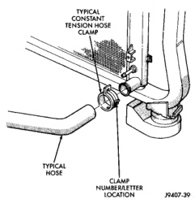
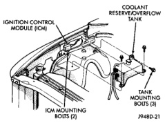
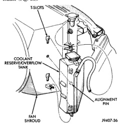
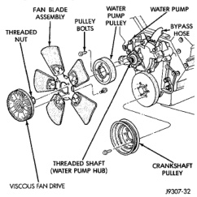

## DESCRIPTION AND OPERATION (Continued)

*Fig. 24 Clamp Number/Letter Location*

As the engine cools, a vacuum is formed in the cooling system of both the radiator and engine. Coolant will then be drawn from the coolant tank and returned to a proper level in the radiator.

On 3.9L/5.2L/5.9L gas engines and the 5.9L diesel engine, the coolant reserve/overflow tank is mounted to the side of the fan shroud (Fig. 25). On the 8.0L V-10 engine the tank is mounted to right inner fender (Fig. 26).

*Fig. 25 Coolant Reserve/Overflow Tank—All Except 8.0L V-10 Engine*

*Fig. 26 Coolant Reserve/Overflow Tank—8.0L V-10 Engine*

Refer to Coolant Level Check—Service, Deaeration and Radiator Pressure Cap sections in this group for coolant reserve/overflow system operation and service.

Should the reserve/overflow tank become coated with corrosion, it can be cleaned with detergent and water. Rinse tank thoroughly before refilling cooling system as described in the Coolant section of this group.

### VISCOUS FAN DRIVE

The thermal viscous fan drive (Fig. 27) (Fig. 28) is a silicone-fluid-filled coupling used to connect the fan blades to the water pump shaft. The coupling allows the fan to be driven in a normal manner. This is done at low engine speeds while limiting the top speed of the fan to a predetermined maximum level at higher engine speeds.

*Fig. 27 Viscous Fan Drive—Gas Engines*
