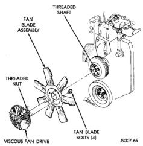
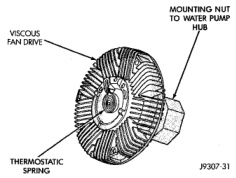

## DESCRIPTION AND OPERATION (Continued)

*Fig. 28 Viscous Fan Drive—Diesel Engine*

A thermostatic bimetallic spring coil is located on the front face of the viscous fan drive unit (a typical viscous unit is shown in (Fig. 29). This spring coil reacts to the temperature of the radiator discharge air. It engages the viscous fan drive for higher fan speed if the air temperature from the radiator rises above a certain point. Until additional engine cooling is necessary, the fan will remain at a reduced rpm regardless of engine speed.

*Fig. 29 Viscous Fan Drive—Typical*

Only when sufficient heat is present, will the viscous fan drive engage. This is when the air flowing through the radiator core causes a reaction to the bimetallic coil. It then increases fan speed to provide the necessary additional engine cooling.

Once the engine has cooled, the radiator discharge temperature will drop. The bimetallic coil again reacts and the fan speed is reduced to the previous disengaged speed.

**CAUTION: Some engines equipped with serpentine drive belts have reverse rotating fans and viscous fan drives. They are marked with the word REVERSE to designate their usage. Installation of the wrong fan or viscous fan drive can result in engine overheating.**

**CAUTION: If the viscous fan drive is replaced because of mechanical damage, the cooling fan blades should also be inspected. Inspect for fatigue cracks, loose blades, or loose rivets that could have resulted from excessive vibration. Replace fan blade assembly if any of these conditions are found. Also inspect water pump bearing and shaft assembly for any related damage due to a viscous fan drive malfunction.**

## DIAGNOSIS AND TESTING

### ON-BOARD DIAGNOSTICS (OBD)

#### COOLING SYSTEM RELATED DIAGNOSTICS

The Powertrain Control Module (PCM) has been programmed to monitor the certain following cooling system components:

- If the engine has remained cool for too long a period, such as with a stuck open thermostat, a Diagnostic Trouble Code (DTC) can be set.
- If an open or shorted condition has developed in the relay circuit controlling the electric radiator fan, a Diagnostic Trouble Code (DTC) can be set.

If the problem is sensed in a monitored circuit often enough to indicate an actual problem, a DTC is stored. The DTC will be stored in the PCM memory for eventual display to the service technician. (Refer to Group 25, Emission Control Systems for proper procedures)

#### ACCESSING DIAGNOSTIC TROUBLE CODES

To read DTC's and to obtain cooling system data, refer to Group 25, Emission Control Systems for proper procedures.

### DRB SCAN TOOL

For operation of the DRB scan tool, refer to the appropriate Powertrain Diagnostic Procedures service manual.
