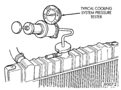
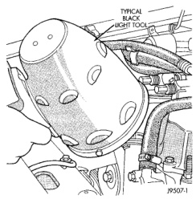

## DIAGNOSIS AND TESTING (Continued)

*Fig. 30 Pressure Testing Cooling System—Typical*

it is certain that coolant is being lost and leaks cannot be detected, inspect for interior leakage or perform Internal Leakage Test.

**Drops Slowly:** Indicates a small leak or seepage is occurring. Examine all connections for seepage or slight leakage with a flashlight. Inspect radiator, hoses, gasket edges and heater. Seal small leak holes with a sealer lubricant (or equivalent). Repair leak holes and inspect system again with pressure applied.

**Drops Quickly:** Indicates that serious leakage is occurring. Examine system for external leakage. If leaks are not visible, inspect for internal leakage. Large radiator leak holes should be repaired by a reputable radiator repair shop.

#### ULTRAVIOLET LIGHT METHOD

A leak detection additive is available through the parts department that can be added to cooling system. The additive is highly visible under ultraviolet light (black light). Pour one ounce of additive into cooling system. Place heater control unit in HEAT position. Start and operate engine until radiator upper hose is warm to touch. Aim the commercially available black light tool at components to be checked. If leaks are present, black light will cause additive to glow a bright green color.

The black light can be used in conjunction with a pressure tester to determine if any external leaks exist (Fig. 31).

*Fig. 31 Leak Detection Using Black Light—Typical*

#### INTERNAL LEAKAGE TEST

Remove engine oil pan drain plug and drain a small amount of engine oil. If coolant is present in the pan, it will drain first because it is heavier than oil. An alternative method is to operate engine for a short period to churn the oil. After this is done, remove engine dipstick and inspect for water globules. Also inspect transmission dipstick for water globules and transmission fluid cooler for leakage.

**WARNING: WITH COOLING SYSTEM PRESSURE TESTER TOOL INSTALLED ON RADIATOR, DO NOT ALLOW PRESSURE TO EXCEED 110 KPA (20 PSI). PRESSURE WILL BUILD UP QUICKLY IF A COMBUSTION LEAK IS PRESENT. TO RELEASE PRESSURE, ROCK TESTER FROM SIDE TO SIDE. WHEN REMOVING TESTER, DO NOT TURN TESTER MORE THAN 1/2 TURN IF SYSTEM IS UNDER PRESSURE.**

Operate engine without pressure cap on radiator until thermostat opens. Attach a pressure tester to filler neck. If pressure builds up quickly it indicates a combustion leak exists. This is usually the result of a cylinder head gasket leak or crack in engine. Repair as necessary.

If there is not an immediate pressure increase, pump the pressure tester. Do this until indicated pressure is within system range of 110 kPa (16 psi). Fluctuation of gauge pointer indicates compression or combustion leakage into cooling system.

Because the vehicle is equipped with a catalytic converter, do not remove spark plug cables or short out cylinders (non-diesel engines) to isolate compression leak.

If the needle on dial of pressure tester does not fluctuate, race engine a few times to check for an abnormal amount of coolant or steam. This would be emitting from exhaust pipe. Coolant or steam from exhaust pipe may indicate a faulty cylinder head gasket, cracked engine cylinder block or cylinder head.
