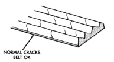

## DIAGNOSIS AND TESTING (Continued)

**CAUTION: Some engines equipped with serpentine drive belts have reverse rotating fans and viscous fan drives. They are marked with the word REVERSE to designate their usage. Installation of the wrong fan or viscous fan drive can result in engine overheating.**

**CAUTION: If the viscous fan drive is replaced because of mechanical damage, the cooling fan blades should also be inspected. Inspect for fatigue cracks, loose blades, or loose rivets that could have resulted from excessive vibration. Replace fan blade assembly if any of these conditions are found. Also inspect water pump bearing and shaft assembly for any related damage due to a viscous fan drive malfunction.**

### ACCESSORY DRIVE BELT DIAGNOSIS

#### VISUAL DIAGNOSIS

When diagnosing serpentine accessory drive belts, small cracks that run across the ribbed surface of the belt from rib to rib (Fig. 32), are considered normal. These are not a reason to replace the belt. However, cracks running along a rib (not across) are not normal. Any belt with cracks running along a rib must be replaced (Fig. 32). Also replace the belt if it has excessive wear, frayed cords or severe glazing.

Refer to the Accessory Drive Belt Diagnosis charts for further belt diagnosis.

*Fig. 32 Belt Wear Patterns*

#### NOISE DIAGNOSIS

Noises generated by the accessory drive belt are most noticeable at idle. Before replacing a belt to resolve a noise condition, inspect all of the accessory drive pulleys for alignment, glazing, or excessive end play.

### ACCESSORY DRIVE BELT DIAGNOSIS CHART

| CONDITION | POSSIBLE CAUSES | CORRECTION |
|-----------|-----------------|------------|
| RIB CHUNKING (One or more ribs has separated from belt body) | 1. Foreign objects imbedded in pulley grooves | 1. Remove foreign objects from pulley grooves. Replace belt. |
| | 2. Installation damage | 2. Replace belt |
| RIB OR BELT WEAR | 1. Pulley misaligned | 1. Align pulley(s) |
| | 2. Abrasive environment | 2. Clean pulley(s). Replace belt if necessary |
| | 3. Rusted pulley(s) | 3. Clean rust from pulley(s) |
| | 4. Sharp or jagged pulley groove tips | 4. Replace pulley. Inspect belt. |
| | 5. Belt rubber deteriorated | 5. Replace belt |
| BELT SLIPS | 1. Belt slipping because of insufficient tension | 1. Inspect/Replace tensioner if necessary |
| | 2. Belt or pulley exposed to substance that has reduced friction (belt dressing, oil, ethylene glycol) | 2. Replace belt and clean pulleys |
