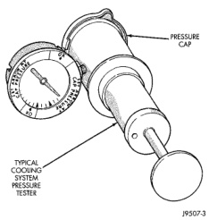

## DIAGNOSIS AND TESTING (Continued)

upper gasket should relieve at 69-124 kPa (10-18 psi) and hold pressure at a minimum of 55 kPa (8 psi).

**WARNING: THE WARNING WORDS "DO NOT OPEN HOT" ON RADIATOR PRESSURE CAP ARE A SAFETY PRECAUTION. WHEN HOT, PRESSURE BUILDS UP IN COOLING SYSTEM. TO PREVENT SCALDING OR INJURY, RADIATOR CAP SHOULD NOT BE REMOVED WHILE SYSTEM IS HOT AND/OR UNDER PRESSURE.**

Do not remove radiator cap at any time **except** for the following purposes:

- Check and adjust antifreeze freeze point
- Refill system with new antifreeze
- Conducting service procedures
- Checking for vacuum leaks

**WARNING: IF VEHICLE HAS BEEN RUN RECENTLY, WAIT AT LEAST 15 MINUTES BEFORE REMOVING RADIATOR CAP. WITH A RAG, SQUEEZE RADIATOR UPPER HOSE TO CHECK IF SYSTEM IS UNDER PRESSURE. PLACE A RAG OVER CAP AND WITHOUT PUSHING CAP DOWN, ROTATE IT COUNTER-CLOCKWISE TO FIRST STOP. ALLOW FLUID TO ESCAPE THROUGH THE COOLANT RESERVE/OVERFLOW HOSE INTO RESERVE/OVERFLOW TANK. SQUEEZE RADIATOR UPPER HOSE TO DETERMINE WHEN PRESSURE HAS BEEN RELEASED. WHEN COOLANT AND STEAM STOP BEING PUSHED INTO TANK AND SYSTEM PRESSURE DROPS, REMOVE RADIATOR CAP COMPLETELY.**

### PRESSURE TESTING RADIATOR CAPS

Remove cap from radiator. Be sure that sealing surfaces are clean. Moisten rubber gasket with water and install cap on pressure tester 7700 or an equivalent (Fig. 33).

Operate tester pump to bring pressure to 104 kPa (15 psi) on gauge. If pressure cap fails to hold pressure of at least 97 kPa (14 psi) replace cap. Refer to CAUTION below.

The pressure cap may test properly while positioned on tool 7700 (or equivalent). It may not hold pressure or vacuum when installed on radiator. If so, inspect radiator filler neck and cap's top gasket for damage. Also inspect for dirt or distortion that may prevent cap from sealing properly.

**CAUTION: Radiator pressure testing tools are very sensitive to small air leaks, which will not cause cooling system problems. A pressure cap that does not have a history of coolant loss should not be replaced just because it leaks slowly when tested with this tool. Add water to tool. Turn tool upside**

*Fig. 33 Pressure Testing Radiator Cap—Typical Tester*

down and recheck pressure cap to confirm that cap needs replacement.

### LOW COOLANT LEVEL—AERATION

If the coolant level in the radiator drops below the top of the radiator core tubes, air will enter the system.

Low coolant level can cause the thermostat pellet to be suspended in air instead of coolant. This will cause the thermostat to open later, which in turn causes higher coolant temperature. Air trapped in cooling system also reduces the amount of coolant circulating in the heater core. This may result in low heat output.

### DEAERATION

As the engine operates, air trapped in the cooling system gathers under the radiator cap. The next time engine is operated, thermal expansion of coolant will push trapped air past radiator cap into coolant reserve/overflow tank. Here it escapes to atmosphere in the tank. When engine cools down the coolant, it will be drawn from reserve/overflow tank into radiator to replace removed air.
