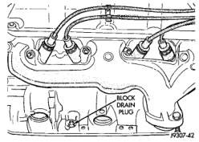

## SERVICE PROCEDURES

### COOLANT LEVEL CHECK—ROUTINE

**NOTE: Do not remove radiator cap for routine coolant level inspections. The coolant level can be checked at the coolant reserve/overflow tank.**

The coolant reserve/overflow system provides a quick visual method for determining the coolant level without removing the radiator pressure cap. With engine idling and at normal operating temperature, observe coolant level in coolant reserve/overflow tank. The coolant level should be between the ADD and FULL marks.

### COOLANT SERVICE—V-6, V-8, AND V-10 ENGINES

It is recommended that the cooling system be drained and flushed at 84,000 kilometers (52,500 miles) or 3 years, whichever occurs first. Then every two years or 48,000 kilometers (30,000 miles), whichever occurs first.

### COOLANT SERVICE—DIESEL ENGINE

It is recommended that the cooling system be drained and flushed every 36 months or 77,000 kilometers (48,000 miles), whichever occurs first.

### ADDING ADDITIONAL COOLANT—ROUTINE

**Do not remove the radiator cap to add coolant to the system.** When adding coolant to maintain the correct level, do so at the coolant reserve/overflow tank with a 50/50 mixture of ethylene glycol antifreeze (containing Alugard 340-2®) and water. Remove the radiator cap only for testing or when refilling the system after service. Removing cap unnecessarily can cause loss of coolant and allow air to enter system. This produces corrosion.

### COOLANT LEVEL CHECK—SERVICE

The cooling system is closed and designed to maintain coolant level to the top of the radiator.

**WARNING: DO NOT OPEN RADIATOR DRAINCOCK WITH ENGINE RUNNING OR WHILE ENGINE IS HOT AND COOLING SYSTEM IS UNDER PRESSURE.**

When vehicle servicing requires a coolant level check in the radiator, drain several ounces of coolant from the radiator drain cock. Do this while observing the coolant reserve/overflow system tank. The coolant level in the reserve/overflow tank should drop slightly. If not, inspect for a leak between radiator and coolant reserve/overflow system connection. Remove radiator cap. The coolant level should be to the top of the radiator. If not and if coolant level in reserve/overflow tank is at the ADD mark, check for:

- An air leak in the coolant reserve/overflow tank
- An air leak in the radiator filler neck
- Leak in the pressure cap seal to the radiator filler neck

### DRAINING COOLING SYSTEM

**WARNING: DO NOT REMOVE THE CYLINDER BLOCK DRAIN PLUGS OR LOOSEN THE RADIATOR DRAIN PLUG WITH SYSTEM HOT AND UNDER PRESSURE. SERIOUS BURNS FROM COOLANT CAN OCCUR.**

DO NOT WASTE reusable coolant. If the solution is clean, drain the coolant into a clean container for reuse.

1. Start the engine and place the heater control temperature selector in the Full-On position. Engine vacuum is needed to actuate the heater controls.

2. Turn the ignition off.

3. Do not remove radiator cap when draining coolant from reserve/overflow tank. Open radiator drain plug and when tank is empty, remove radiator cap. If the coolant reserve/overflow tank does not drain, refer to the Testing Cooling System for Leaks section in this group. The coolant need not be removed from tank unless the system is being refilled with fresh mixture.

4. On vehicles equipped with gas powered engines, remove the cylinder block drain plugs. These are located on the sides of the block just above the oil pan (Fig. 34).

*Fig. 34 Drain Plugs—Gas Powered Engines—Typical*

5. Remove radiator pressure cap.

### REFILLING COOLING SYSTEM

Clean cooling system prior to refilling. Refer to Cooling System Cleaning section of this group.

1. Install the cylinder block drain plugs (Fig. 34).

2. Close radiator drain plug.
