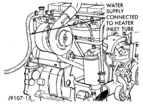

## SERVICE PROCEDURES (Continued)

3. Fill the cooling system with a 50/50 mixture of water and antifreeze. **5.9L Diesel Engine Only:** The diesel engine is equipped with a one-way check valve (jiggle pin). The check valve is used as a servicing feature and will vent air when the system is being filled. Water pressure (or flow) will hold the valve closed. **Due to the use of this valve, the engine must not be operating when refilling the cooling system.** Refer to Thermostat Operation—5.9L Diesel Engine in the Thermostat section of this group for more information.

4. Fill coolant reserve/overflow tank to the FULL mark.

5. Start and operate engine until thermostat opens. Upper radiator hose should be warm to touch.

6. If necessary, add 50/50 water and antifreeze mixture to the coolant reserve/overflow tank to maintain coolant level. This level should be between the ADD and FULL marks. The level in the reserve/overflow tank may drop below the ADD mark after three or four warm-up and cool-down cycles.

### COOLING SYSTEM CLEANING/REVERSE FLUSHING

#### CLEANING

Drain cooling system and refill with water. Run engine with radiator cap installed until upper radiator hose is hot. Stop engine and drain water from system. If water is dirty, fill system with water, run engine and drain system. Repeat until water drains clean.

#### REVERSE FLUSHING

Reverse flushing of cooling system is the forcing of water through the cooling system. This is done using air pressure in the opposite direction of normal coolant flow. It is usually only necessary with very dirty systems with evidence of partial plugging.

#### REVERSE FLUSHING RADIATOR

Disconnect radiator hoses from radiator inlet and outlet. Attach a section of radiator hose to radiator bottom outlet fitting and insert flushing gun. Connect a water supply hose and air supply hose to flushing gun.

**CAUTION: Internal radiator pressure must not exceed 138 kPa (20 psi) as damage to radiator may result.**

Allow radiator to fill with water. When radiator is filled, apply air in short blasts. Allow radiator to refill between blasts. Continue this reverse flushing until clean water flows out through rear of radiator cooling tube passages. Have radiator cleaned more extensively by a radiator repair shop.

#### REVERSE FLUSHING ENGINE—V-6, V-8, AND V-10

Drain cooling system. Remove thermostat housing and thermostat. Install thermostat housing. Disconnect radiator upper hose from radiator and attach flushing gun to hose. Disconnect radiator lower hose from water pump and attach a lead-away hose to water pump inlet fitting.

Connect water supply hose and air supply hose to flushing gun. Allow engine to fill with water. When engine is filled, apply air in short blasts, allowing system to fill between air blasts. Continue until clean water flows through the lead away hose.

Remove lead away hose, flushing gun, water supply hose and air supply hose. Remove thermostat housing and install thermostat. Install thermostat housing with a replacement gasket. Refer to Thermostat Replacement. Connect radiator hoses. Refill cooling system with correct antifreeze/water mixture. Refer to Refilling the Cooling System.

#### REVERSE FLUSHING ENGINE—DIESEL

1. Drain the cooling system.

2. Disconnect the radiator lower hose from the water inlet connection.

3. Remove the heater core inlet hose from tube (Fig. 35).

*Fig. 35 Typical Reverse-flushing—5.9L Diesel*

4. Attach water supply hose to heater tube.

5. Back-flush the engine until clean water exits the water pump inlet.

#### CHEMICAL CLEANING

In some instances, use a radiator cleaner (Mopar Radiator Kleen or equivalent) before flushing. This will soften scale and other deposits and aid flushing operation.

**CAUTION: Follow manufacturers instructions when using these products.**
