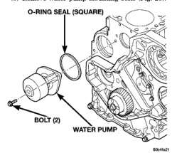

# 7-28 COOLING SYSTEM

## REMOVAL AND INSTALLATION (Continued)

*Fig. 28 Cooling Fan Support/Hub Assembly*

(3) Remove the bolt retaining the wiring harness near the top of water pump. Position wire harness to the side.
(4) Remove the accessory drive belt. Refer to procedure in this group.
(5) Remove water pump mounting bolts (Fig. 28).

*Fig. 29 O-RING SEAL (SQUARE)*

*Fig. 28 Water Pump Removal/Installation*

(6) Clean water pump sealing surface on cylinder block.

#### INSTALLATION

(1) Install new O-ring seal in groove on water pump (Fig. 29).
(2) Install water pump. Tighten mounting bolts to 24 N·m (18 ft. lbs.) torque.

*Fig. 29 Pump O-ring Seal*

(3) Install accessory drive belt. Refer to procedure in this group.
(4) Install the bolt retaining the wiring harness near top of water pump.
(5) Fill cooling system. Refer to Refilling Cooling System in this section.
(6) Connect both battery cables.
(7) Start and warm the engine. Check for leaks.

### RADIATOR

#### REMOVAL

(1) Disconnect the battery negative cables.

**WARNING:** DO NOT REMOVE THE CYLINDER BLOCK DRAIN PLUGS OR LOOSEN THE RADIATOR DRAINCOCK WITH THE SYSTEM HOT AND UNDER PRESSURE. SERIOUS BURNS FROM COOLANT CAN OCCUR.

(2) Drain the cooling system. Refer to Draining Cooling System in this group.

**WARNING:** CONSTANT TENSION HOSE CLAMPS ARE USED ON MOST COOLING SYSTEM HOSES. WHEN REMOVING OR INSTALLING, USE ONLY TOOLS DESIGNED FOR SERVICING THIS TYPE OF CLAMP, SUCH AS SPECIAL CLAMP TOOL (NUMBER 6094). SNAP-ON CLAMP TOOL (NUMBER HPC-20) MAY BE USED FOR LARGER CLAMPS. ALWAYS WEAR SAFETY GLASSES WHEN SERVICING CONSTANT TENSION CLAMPS.

**CAUTION:** A number or letter is stamped into the tongue of constant tension clamps. If replacement is necessary, use only an original equipment clamp with a matching number or letter.

(3) Remove the radiator upper hose and clamps.