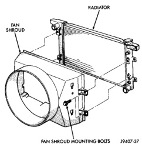
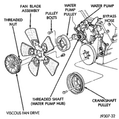

## REMOVAL AND INSTALLATION (Continued)

*Fig. 38 Typical Fan Shroud Mounting*

**WARNING: CONSTANT TENSION HOSE CLAMPS ARE USED ON MOST COOLING SYSTEM HOSES. WHEN REMOVING OR INSTALLING, USE ONLY TOOLS DESIGNED FOR SERVICING THIS TYPE OF CLAMP, SUCH AS SPECIAL CLAMP TOOL (NUMBER 6094). SNAP-ON CLAMP TOOL (NUMBER HPC-20) MAY BE USED FOR LARGER CLAMPS. ALWAYS WEAR SAFETY GLASSES WHEN SERVICING CONSTANT TENSION CLAMPS.**

**CAUTION: A number or letter is stamped into the tongue of constant tension clamps. If replacement is necessary, use only an original equipment clamp with a matching number or letter.**

6. Remove upper radiator hose at radiator.

7. The thermal viscous fan drive is attached (threaded) to the water pump hub shaft (Fig. 39). Remove the fan/fan drive assembly from water pump by turning the mounting nut counterclockwise (as viewed from front). Threads on the fan drive are **RIGHT-HAND**. A Snap-On 36 MM Fan Wrench (number SP346 from Snap-On Cummins Diesel Tool Set number 2017DSP) can be used. Place a bar or screwdriver between the water pump pulley bolts (Fig. 39) to prevent the pulley from rotating.

8. If water pump is being replaced, do not unbolt fan blade assembly (Fig. 39) from the thermal control fan drive.

9. Remove fan blade/fan drive and fan shroud as an assembly from vehicle.

10. After removing fan blade/fan drive assembly, **do not** place the thermal viscous fan drive in the horizontal position. If stored horizontally, the silicone fluid in the viscous drive could drain into its bearing assembly and contaminate the bearing lubricant.

11. Do not remove the water pump pulley bolts at this time.

*Fig. 39 Fan Blade and Viscous Fan Drive—Typical*

12. Remove accessory drive belt as follows: The drive belt is equipped with a spring loaded automatic tensioner (Fig. 40) (Fig. 41).

13. 3.9L V-6 or 5.2/5.9L V-8 LDC-Gas Engines: Relax the tension from the belt by rotating the tensioner clockwise (as viewed from front) (Fig. 40). When all belt tension has been relaxed, remove accessory drive belt.

14. 5.9L HDC-Gas Engine: Relax the tension from the belt by rotating the tensioner counterclockwise (as viewed from front) (Fig. 41). When all belt tension has been relaxed, remove accessory drive belt.

15. Remove the four water pump pulley-to-water pump hub bolts (Fig. 39) and remove pulley from vehicle.

16. Remove the lower radiator hose and heater hose from water pump.

17. Loosen heater hose coolant return tube mounting bolt (Fig. 42) (Fig. 43) and remove tube from water pump. Discard the old tube O-ring.

18. Remove the seven water pump mounting bolts (Fig. 44).

19. Loosen the clamp at the water pump end of bypass hose (Fig. 39). Slip the bypass hose from the water pump while removing pump from vehicle. Do not remove the clamp from the bypass hose.

20. Discard old gasket.
