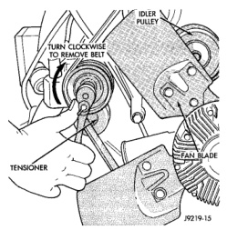
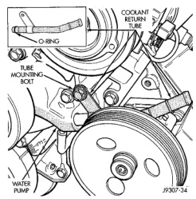
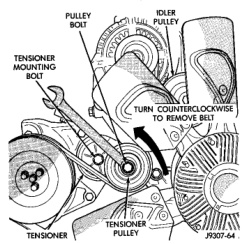
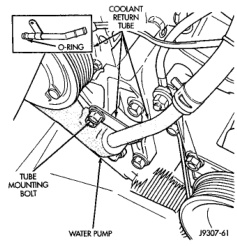

## REMOVAL AND INSTALLATION (Continued)

*Fig. 40 Belt Tensioner—3.9L V-6 or 5.2/5.9L V-8 LDC-Gas Engines*

*Fig. 41 Belt Tensioner—5.9L HDC-Gas Engine*

**CAUTION: Do not pry the water pump at timing chain case/cover. The machined surfaces may be damaged resulting in leaks.**

#### INSTALLATION

1. Clean gasket mating surfaces.

2. Using a new gasket, install water pump to engine as follows: Guide water pump nipple into

*Fig. 42 Coolant Return Tube—3.9L V-6 or 5.2/5.9L V-8 LDC-Gas Engines*

*Fig. 43 Coolant Return Tube—5.9L HDC-Gas Engine*

bypass hose as pump is being installed. Install water pump bolts (Fig. 44). Tighten water pump mounting bolts to 40 N·m (30 ft. lbs.) torque.

3. Position bypass hose clamp to bypass hose.

4. Spin water pump to be sure that pump impeller does not rub against timing chain case/cover.

5. Install a new o-ring to the heater hose coolant return tube (Fig. 42) (Fig. 43). Coat the new o-ring with antifreeze before installation.
