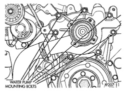
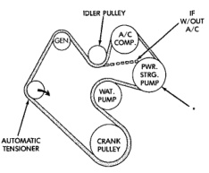
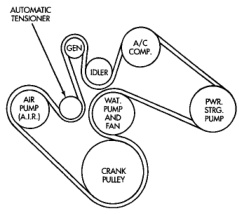

## REMOVAL AND INSTALLATION (Continued)

*Fig. 44 Water Pump Bolts—3.9L V-6 or 5.2/5.9L V-8 Gas Engines—Typical*

6. Install coolant return tube and its mounting bolt to engine (Fig. 42) (Fig. 43). Be sure the slot in tube bracket is bottomed to mounting bolt. This will properly position return tube.

7. Connect radiator lower hose to water pump.

8. Connect heater hose and hose clamp to coolant return tube.

9. Install water pump pulley. Tighten bolts to 27 N·m (20 ft. lbs.) torque. Place a bar or screwdriver between water pump pulley bolts (Fig. 39) to prevent pulley from rotating.

10. Relax tension from automatic belt tensioner (Fig. 40) (Fig. 41). Install drive belt.

**CAUTION: When installing the serpentine accessory drive belt, the belt must be routed correctly. If not, engine may overheat due to water pump rotating in wrong direction. Refer to (Fig. 45) (Fig. 46) (Fig. 47) for correct belt routing. The correct belt with correct length must be used.**

11. Position fan shroud and fan blade/viscous fan drive assembly to vehicle as a complete unit.

12. Install fan shroud.

13. Install fan blade/viscous fan drive assembly to water pump shaft.

14. Fill cooling system. Refer to Refilling Cooling System in this group.

15. Connect negative battery cable.

16. Start and warm the engine. Check for leaks.

*Fig. 42 Belt Routing—3.9L V-6 or 5.2/5.9L V-8 LDC-Gas Engines*

*If vehicle is not equipped with power steering, this will be an idler pulley.

*Fig. 45 Belt Routing—3.9L V-6 or 5.2/5.9L V-8 LDC-Gas Engines*

*Fig. 43 Belt Routing—5.9L HDC-Gas Engine—With A/C*

*Fig. 46 Belt Routing—5.9L HDC-Gas Engine—With A/C*

### WATER PUMP—8.0L V-10 ENGINE

#### REMOVAL

The water pump on all models can be removed without discharging the air conditioning system (if equipped).

The water pump on all gas powered engines is bolted directly to the engine timing chain case/cover.

On the 8.0L V-10 engine, a rubber o-ring (instead of a gasket) is used as a seal between the water pump and timing chain case/cover.

If water pump is replaced because of bearing/shaft damage or leaking shaft seal, the mechanical cooling fan assembly should also be inspected. Inspect for
