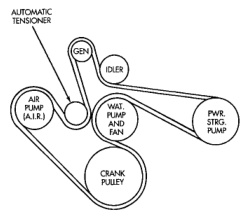
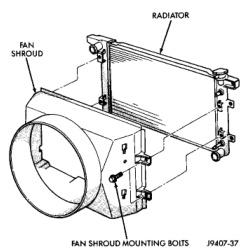

## REMOVAL AND INSTALLATION (Continued)

*Fig. 47 Belt Routing—5.9L HDC-Gas Engine—Without A/C*

fatigue cracks, loose blades or loose rivets that could have resulted from excessive vibration. Replace fan if any of these conditions are found. Also check condition of the thermal viscous fan drive. Refer to Viscous Fan Drive in this group.

1. Disconnect negative battery cable from battery.

2. Drain cooling system. Refer to Draining Cooling System in this group.

Do not waste reusable coolant. If solution is clean, drain coolant into a clean container for reuse.

3. Remove windshield washer reservoir tank from radiator fan shroud. Refer to Group 8K, Windshield Wiper and Washer Systems.

4. Remove the four fan shroud mounting bolts at the radiator (Fig. 48). Do not attempt to remove shroud from vehicle at this time.

**WARNING: CONSTANT TENSION HOSE CLAMPS ARE USED ON MOST COOLING SYSTEM HOSES. WHEN REMOVING OR INSTALLING, USE ONLY TOOLS DESIGNED FOR SERVICING THIS TYPE OF CLAMP, SUCH AS SPECIAL CLAMP TOOL (NUMBER 6094). SNAP-ON CLAMP TOOL (NUMBER HPC-20) MAY BE USED FOR LARGER CLAMPS. ALWAYS WEAR SAFETY GLASSES WHEN SERVICING CONSTANT TENSION CLAMPS.**

**CAUTION: A number or letter is stamped into the tongue of constant tension clamps. If replacement is necessary, use only an original equipment clamp with a matching number or letter.**

*Fig. 48 Typical Fan Shroud Mounting*

5. Remove upper radiator hose at radiator.

6. The thermal viscous fan drive is attached (threaded) to the water pump hub shaft (Fig. 49). Remove the fan/fan drive assembly from water pump by turning the mounting nut counterclockwise (as viewed from front). Threads on the fan drive are **RIGHT-HAND**. A Snap-On 36 MM Fan Wrench (number SP346 from Snap-On Cummins Diesel Tool Set number 2017DSP) can be used. Place a bar or screwdriver between the water pump pulley bolts (Fig. 49) to prevent the pulley from rotating.

7. If water pump is being replaced, do not unbolt fan blade assembly (Fig. 49) from the thermal control fan drive.

8. Remove fan blade/fan drive and fan shroud as an assembly from vehicle.

After removing fan blade/fan drive assembly, **do not** place the thermal viscous fan drive in the horizontal position. If stored horizontally, the silicone fluid in the viscous drive could drain into its bearing assembly and contaminate the bearing lubricant.

**Do not** remove the water pump pulley bolts at this time.

9. Remove accessory drive belt by placing a wrench or socket on the accessory drive belt tensioner pulley bolt (Fig. 50). Rotate the tensioner pulley counter-clockwise until belt tension is relieved and slip the belt off of the alternator pulley.

**NOTE: The belt tensioner pulley bolt will not loosen because it has left-handed threads.**
