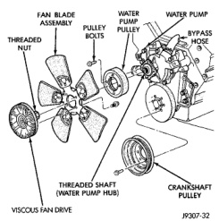
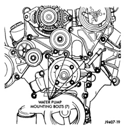
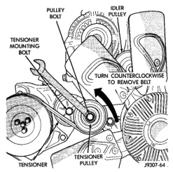
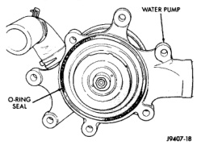

## REMOVAL AND INSTALLATION (Continued)

*Fig. 49 Fan Blade and Viscous Fan Drive—Typical*

*Fig. 50 Belt Tensioner—8.0L V-10 Engine*

10. Remove the four water pump pulley-to-water pump hub bolts (Fig. 49) and remove pulley from vehicle.

11. Remove the lower radiator hose at water pump.

12. Remove heater hose at water pump fitting.

13. Remove the seven water pump mounting bolts (Fig. 51).

14. Loosen the clamp at the water pump end of bypass hose. Slip the bypass hose from the water

*Fig. 51 Water Pump Bolts—8.0L V-10—Typical*

pump while removing pump from vehicle. Do not remove the clamp from the bypass hose.

15. Discard the water pump-to-timing chain/case cover o-ring seal (Fig. 52).

*Fig. 52 Water Pump O-Ring Seal—8.0L V-10*

16. Remove the heater hose fitting from water pump if pump replacement is necessary. Note position (direction) of fitting before removal. Fitting must be re-installed to same position.

**CAUTION: Do not pry the water pump at timing chain case/cover. The machined surfaces may be damaged resulting in leaks.**
