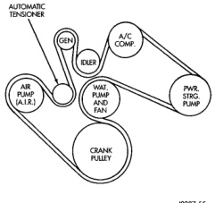
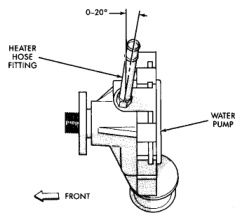
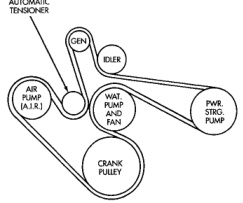

## REMOVAL AND INSTALLATION (Continued)

#### INSTALLATION

1. If water pump is being replaced, install the heater hose fitting to the pump. Tighten fitting to 16 N·m (144 in. lbs.) torque. After fitting has been torqued, position fitting as shown in (Fig. 53). When positioning fitting, do not back off (rotate counterclockwise). Use a sealant on the fitting such as Mopar® Thread Sealant With Teflon. Refer to the directions on the package.

**CAUTION: This heater hose fitting must be installed to pump before pump is installed to engine.**

*Fig. 53 Heater Hose Fitting Position—8.0L V-10*

2. Clean the o-ring mating surfaces at rear of water pump and front of timing chain/case cover.

3. Apply a small amount of petroleum jelly to o-ring (Fig. 52). This will help retain o-ring to water pump.

4. Install water pump to engine as follows: Guide water pump fitting into bypass hose as pump is being installed. Install water pump bolts (Fig. 51). Tighten water pump mounting bolts to 40 N·m (30 ft. lbs.) torque.

5. Position bypass hose clamp to bypass hose.

6. Spin water pump to be sure that pump impeller does not rub against timing chain case/cover.

7. Connect radiator lower hose to water pump.

8. Connect heater hose and hose clamp to heater hose fitting.

9. Install water pump pulley. Tighten bolts to 22 N·m (16 ft. lbs.) torque. Place a bar or screwdriver between water pump pulley bolts (Fig. 49) to prevent pulley from rotating.

10. Relax tension from automatic belt tensioner (Fig. 50). Install drive belt.

**CAUTION: When installing the serpentine accessory drive belt, the belt must be routed correctly. If not, engine may overheat due to water pump rotating in wrong direction. Refer to (Fig. 54) (Fig. 55) for correct belt routing. The correct belt with correct length must be used.**

*Fig. 54 Belt Routing—8.0L V-10 Engine—With A/C*

*Fig. 52 Belt Routing—8.0L V-10 Engine—Without A/C*

*Fig. 55 Belt Routing—8.0L V-10 Engine—Without A/C*
