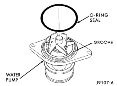
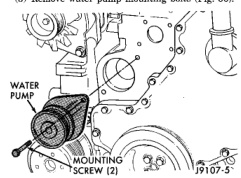
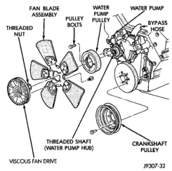

## REMOVAL AND INSTALLATION (Continued)

11. Position fan shroud and fan blade/viscous fan drive assembly to vehicle as a complete unit.

12. Install fan shroud to radiator. Tighten bolts to 6 N·m (50 in. lbs.) torque.

13. Install fan blade/viscous fan drive assembly to water pump shaft.

14. Fill cooling system. Refer to Refilling Cooling System in this group.

15. Connect negative battery cable.

16. Start and warm the engine. Check for leaks.

### WATER PUMP—5.9L DIESEL

#### REMOVAL

1. Disconnect the negative battery cables from both batteries.

2. Drain cooling system. Refer to Draining Cooling System in this section.

3. Remove the bolt retaining the wiring harness near the top of water pump. Position wire harness to the side.

4. Remove the accessory drive belt. Refer to the Engine Accessory Drive Belt section of this group.

5. Remove water pump mounting bolts (Fig. 56).

*Fig. 56 Pump Removal/Installation—5.9L Diesel*

6. Clean water pump sealing surface on cylinder block.

#### INSTALLATION

1. Install new O-ring seal in groove on water pump (Fig. 57).

2. Install water pump. Tighten mounting bolts to 24 N·m (18 ft. lbs.) torque.

3. Install accessory drive belt. Refer to the Engine Accessory Drive Belt section of this group.

4. Install the bolt retaining the wiring harness near top of water pump.

5. Fill cooling system. Refer to Refilling Cooling System in this section.

6. Connect both battery cables.

*Fig. 57 Pump O-ring Seal—5.9L Diesel*

7. Start and warm the engine. Check for leaks.

### WATER PUMP BYPASS HOSE

#### REMOVAL—3.9L V-6 OR 5.2/5.9L V-8 ENGINES WITHOUT AIR CONDITIONING

A water pump bypass hose (Fig. 58) is used between the intake manifold and water pump on all gas powered engines. To test for leaks, refer to Testing Cooling System for Leaks in this group.

*Fig. 58 Water Pump Bypass Hose—Typical*

1. Partially drain cooling system. Refer to Draining Cooling System in this group.

2. Do not waste reusable coolant. If the solution is clean, drain the coolant into a clean container for reuse.
