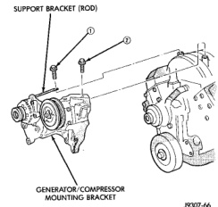
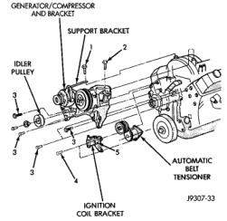

## REMOVAL AND INSTALLATION (Continued)

**WARNING: CONSTANT TENSION HOSE CLAMPS ARE USED ON MOST COOLING SYSTEM HOSES. WHEN REMOVING OR INSTALLING, USE ONLY TOOLS DESIGNED FOR SERVICING THIS TYPE OF CLAMP, SUCH AS SPECIAL CLAMP TOOL (NUMBER 6094). SNAP-ON CLAMP TOOL (NUMBER HPC-20) MAY BE USED FOR LARGER CLAMPS. ALWAYS WEAR SAFETY GLASSES WHEN SERVICING CONSTANT TENSION CLAMPS.**

**CAUTION: A number or letter is stamped into the tongue of constant tension clamps. If replacement is necessary, use only an original equipment clamp with a matching number or letter.**

3. Loosen both bypass hose clamps and position to the center of hose.

4. Remove hose from vehicle.

#### INSTALLATION

1. Position bypass hose clamps to the center of hose.

2. Install bypass hose to engine.

3. Secure both hose clamps.

4. Fill cooling system. Refer to Refilling Cooling System in this group.

5. Start and warm the engine. Check for leaks.

#### REMOVAL—3.9L V-6 OR 5.2/5.9L V-8 ENGINE—WITH AIR CONDITIONING

If equipped with A/C, the generator and A/C compressor along with their common mounting bracket (Fig. 59) must be partially removed. Removing the generator or A/C compressor from their mounting bracket is not necessary. Also, discharging the A/C system is not necessary. **Do not** remove any refrigerant lines from A/C compressor.

**WARNING: THE A/C SYSTEM IS UNDER PRESSURE EVEN WITH THE ENGINE OFF. REFER TO REFRIGERANT WARNINGS IN GROUP 24, HEATING AND AIR CONDITIONING.**

1. Disconnect negative battery cable from battery.

2. Partially drain cooling system. Refer to Draining Cooling System in this group.

3. Do not waste reusable coolant. If the solution is clean, drain the coolant into a clean container for reuse.

4. Remove upper radiator hose clamp at radiator. A special clamp tool must be used to remove the constant tension clamps. Remove hose at radiator.

5. Disconnect throttle cable from clip at radiator fan shroud.

6. Unplug wiring harness from A/C compressor.

7. Remove the air cleaner assembly.

*Fig. 59 Generator—A/C Compressor Mounting Bracket—Typical*

8. Remove accessory drive belt. Refer to Belt Removal/Installation in the Engine Accessory Drive Belt section of this group.

9. 3.9L V-6 or 5.2/5.9L V-8 LDC-Gas: The drive belt idler pulley must be removed to gain access to one of the A/C compressor/generator bracket mounting bolts. Remove the idler pulley bolt and remove idler pulley (Fig. 60).

*Fig. 60 Idler Pulley—3.9L V-6 or 5.2/5.9L V-8 LDC-Gas Engines*
