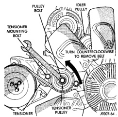
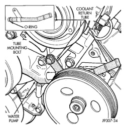
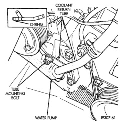

## REMOVAL AND INSTALLATION (Continued)

10. 5.9L HDC-Gas: The automatic belt tensioner/pulley assembly must be removed to gain access to one of the A/C compressor/generator bracket mounting bolts. Remove the tensioner mounting bolt (Fig. 61) and remove tensioner.

*Fig. 61 Belt Tensioner—5.9L HDC-Gas Engine*

11. Remove the engine oil dipstick tube mounting bolt at the side of the A/C-generator mounting bracket.

12. Disconnect throttle body control cables. Refer to Accelerator Pedal and Throttle Cable in Group 14, Fuel System.

13. Remove heater hose coolant return tube mounting bolt (Fig. 62) (Fig. 63) and remove tube from engine. Discard the old tube O-ring.

14. Remove bracket-to-intake manifold bolts (number 1 and 2 (Fig. 59).

15. Remove remaining bracket-to-engine bolts (Fig. 64) (Fig. 65).

16. Lift and position generator and A/C compressor (along with their common mounting bracket) to gain access to bypass hose. A block of wood may be used to hold assembly in position.

17. Loosen and position both hose clamps to the center of bypass hose. A special clamp tool must be used to remove the constant tension clamps. Remove hose from vehicle.

#### INSTALLATION

1. Position bypass hose clamps to the center of hose.

2. Install bypass hose to engine.

3. Secure both hose clamps.

*Fig. 62 Coolant Return Tube—3.9L V-6 or 5.2/5.9L V-8 LDC-Gas Engines*

*Fig. 63 Coolant Return Tube—5.9L HDC-Gas Engine*

4. Install generator-A/C mounting bracket assembly to engine. Tighten bolt number 1 (Fig. 59) to 41 N·m (30 ft. lbs.) torque. Tighten bolt number 2 (Fig. 59) to 28 N·m (20 ft. lbs.) torque. Tighten bracket mounting bolts (Fig. 64) (Fig. 65) to 40 N·m (30 ft. lbs.) torque.

5. Install a new O-ring to the heater hose coolant return tube (Fig. 62) (Fig. 63). Coat the new O-ring with antifreeze before installation.
