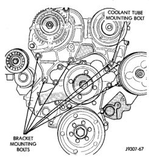
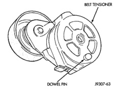
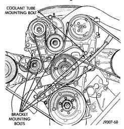
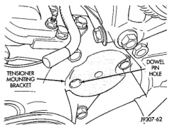

## REMOVAL AND INSTALLATION (Continued)

*Fig. 64 Bracket Bolts—3.9L V-6 or 5.2/5.9L V-8 LDC-Gas Engines*

*Fig. 65 Bracket Bolts—5.9L HDC-Gas Engine*

6. Install coolant return tube and its mounting bolt to engine (Fig. 62) (Fig. 63).

7. Connect throttle body control cables.

8. Install oil dipstick mounting bolt.

9. 3.9L V-6 or 5.2/5.9L V-8 LDC-Gas Engines: Install idler pulley. Tighten bolt to 41 N·m (30 ft. lbs.) torque.

10. 5.9L HDC-Gas: Install automatic belt tensioner assembly to mounting bracket. A dowel pin is located on back of tensioner (Fig. 66). Align this to dowel hole (Fig. 67) in tensioner mounting bracket. Tighten bolt to 41 N·m (30 ft. lbs.) torque.

*Fig. 62 Tensioner Dowel Pin—5.9L HDC-Gas Engine*

*Fig. 66 Tensioner Dowel Pin—5.9L HDC-Gas Engine*

*Fig. 63 Tensioner Mounting Bracket Dowel Hole—5.9L HDC-Gas Engine*

*Fig. 67 Tensioner Mounting Bracket Dowel Hole—5.9L HDC-Gas Engine*

11. Install drive belt. Refer to Belt Removal/Installation in the Engine Accessory Drive Belt section of this group.

**CAUTION: When installing the serpentine accessory drive belt, the belt must be routed correctly. If not, the engine may overheat due to the water pump rotating in the wrong direction. Refer to Belt Schematics in the Engine Accessory Drive Belt section of this group for correct belt routing. The correct belt with the correct length must be used.**

12. Install air cleaner assembly.

13. Install upper radiator hose to radiator.
