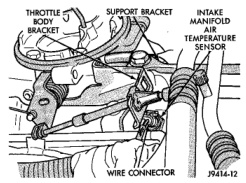
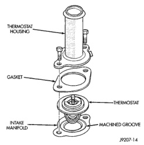

## REMOVAL AND INSTALLATION (Continued)

14. Connect throttle cable to clip at radiator fan shroud.

15. Connect wiring harness to A/C compressor.

16. Fill cooling system. Refer to Refilling Cooling System in this group.

17. Start and warm the engine. Check for leaks.

### THERMOSTAT—3.9L V-6 OR 5.2/5.9L V-8

#### REMOVAL

**WARNING: DO NOT LOOSEN THE RADIATOR DRAINCOCK WITH THE SYSTEM HOT AND PRESSURIZED. SERIOUS BURNS FROM THE COOLANT CAN OCCUR.**

Do not waste reusable coolant. If the solution is clean, drain the coolant into a clean container for reuse.

If the thermostat is being replaced, be sure that the replacement is the specified thermostat for the vehicle model and engine type.

Factory installed thermostat housings on 3.9L V-6 or 5.2/5.9L V-8 engines are installed on a gasket with an anti-stick coating. This will aid in gasket removal and cleanup.

1. Disconnect negative battery cable at battery.

2. Drain cooling system until coolant level is below thermostat. Refer to Draining Cooling System in this group. If not equipped with air conditioning, proceed to step number 4.

3. If equipped with air conditioning:
   - (a) Remove the support bracket (rod) located near the rear of generator (Fig. 68).
   - (b) The drive belt must be removed. Refer to Belt Removal/Installation in the Engine Accessory Drive Belt section of this group.
   - (c) The generator must be partially removed. Remove the two generator mounting bolts. Do not remove any wiring at generator. If equipped with 4WD, unplug the 4WD indicator lamp wiring harness (located near rear of generator).
   - (d) Remove generator. Position generator to gain access for thermostat gasket removal.

**WARNING: CONSTANT TENSION HOSE CLAMPS ARE USED ON MOST COOLING SYSTEM HOSES. WHEN REMOVING OR INSTALLING, USE ONLY TOOLS DESIGNED FOR SERVICING THIS TYPE OF CLAMP, SUCH AS SPECIAL CLAMP TOOL (NUMBER 6094). SNAP-ON CLAMP TOOL (NUMBER HPC-20) MAY BE USED FOR LARGER CLAMPS. ALWAYS WEAR SAFETY GLASSES WHEN SERVICING CONSTANT TENSION CLAMPS.**

*Fig. 68 Support Bracket—Generator Mounting Bracket-to-Intake Manifold—Typical*

**CAUTION: A number or letter is stamped into the tongue of constant tension clamps. If replacement is necessary, use only an original equipment clamp with a matching number or letter.**

4. Remove upper radiator hose clamp. Remove upper radiator hose at thermostat housing.

5. Position the wiring harness (behind the thermostat housing) to gain access to thermostat housing.

6. Remove thermostat housing mounting bolts, thermostat housing, gasket and thermostat (Fig. 69). Discard old gasket.

*Fig. 69 Thermostat—3.9L V-6 or 5.2/5.9L V-8 Gas Engines*
