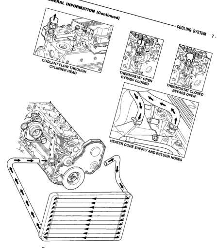

# 7-3

## COOLING SYSTEM — BR

## GENERAL INFORMATION (Continued)

*Fig. 1 Cooling System Circulation - Diagram showing coolant flow through cylinder head, thermostat, bypass hoses, heater core supply and return hoses, and radiator with engine block]*