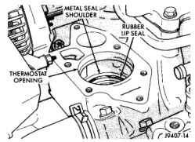
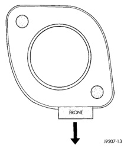

## REMOVAL AND INSTALLATION (Continued)

#### INSTALLATION

1. Clean mating areas of intake manifold and thermostat housing.

2. Install thermostat (spring side down) into recessed machined groove on intake manifold (Fig. 69).

3. Install gasket on intake manifold and over thermostat (Fig. 69).

4. Position the thermostat housing to the intake manifold. Note the word FRONT stamped on the housing (Fig. 70). For adequate clearance, this **must** be placed towards the front of vehicle. The housing should be slightly angled forward after installation to intake manifold.

*Fig. 70 Thermostat Position—3.9L V-6 or 5.2/5.9L V-8 Gas Engines*

5. Install two housing-to-intake manifold bolts. Tighten bolts to 23 N·m (200 in. lbs.) torque.

**CAUTION: Housing must be tightened evenly and thermostat must be centered into recessed groove in intake manifold. If not, it may result in a cracked housing, damaged intake manifold threads or coolant leak.**

6. Install upper radiator hose to thermostat housing.

7. Air conditioned vehicles:
   - (a) Install generator. Tighten bolts to 41 N·m (30 ft. lbs.) torque.
   - (b) Install support bracket (generator mounting bracket-to-intake manifold) (Fig. 68). Tighten bolts to 54 N·m (40 ft. lbs.) torque.

**CAUTION: When installing the serpentine accessory drive belt, the belt must be routed correctly. If not, the engine may overheat due to the water pump rotating in the wrong direction. Refer to Belt Schematics in the Engine Accessory Drive Belt section of this group for correct engine belt routing. The correct belt with the correct length must be used.**

8. Fill cooling system. Refer to Refilling Cooling System in this group.

9. Connect negative battery cable to battery.

10. Start and warm engine. Check for leaks.

### THERMOSTAT—8.0L V-10

#### REMOVAL

**WARNING: DO NOT LOOSEN THE RADIATOR DRAINCOCK WITH THE SYSTEM HOT AND PRESSURIZED. SERIOUS BURNS FROM THE COOLANT CAN OCCUR.**

Do not waste reusable coolant. If the solution is clean, drain the coolant into a clean container for reuse.

If the thermostat is being replaced, be sure that the replacement is the specified thermostat for the vehicle model and engine type.

A rubber lip-type seal with a metal shoulder is pressed into the intake manifold beneath the thermostat (Fig. 71).

*Fig. 69 Thermostat Seal—8.0L V-10 Engine*

*Fig. 71 Thermostat Seal—8.0L V-10 Engine*

1. Disconnect negative battery cable at battery.

2. Drain cooling system until coolant level is below thermostat. Refer to Draining Cooling System in this group.

3. Remove the two support rod mounting bolts and remove support rod (intake manifold-to-generator mount) (Fig. 72).
