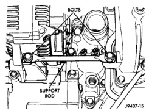
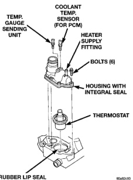

## REMOVAL AND INSTALLATION (Continued)

*Fig. 72 Support Rod—8.0L V-10 Engine*

**WARNING: CONSTANT TENSION HOSE CLAMPS ARE USED ON MOST COOLING SYSTEM HOSES. WHEN REMOVING OR INSTALLING, USE ONLY TOOLS DESIGNED FOR SERVICING THIS TYPE OF CLAMP, SUCH AS SPECIAL CLAMP TOOL (NUMBER 6094). SNAP-ON CLAMP TOOL (NUMBER HPC-20) MAY BE USED FOR LARGER CLAMPS. ALWAYS WEAR SAFETY GLASSES WHEN SERVICING CONSTANT TENSION CLAMPS.**

**CAUTION: A number or letter is stamped into the tongue of constant tension clamps. If replacement is necessary, use only an original equipment clamp with a matching number or letter.**

4. Remove upper radiator hose clamp. Remove upper radiator hose at thermostat housing.

5. Disconnect the wiring connectors at both of the sensors located on thermostat housing.

6. Remove six thermostat housing mounting bolts, thermostat housing and thermostat.

#### INSTALLATION

1. Clean mating areas of intake manifold and thermostat housing.

2. Check the condition (for tears or cracks) of the rubber thermostat seal located in the intake manifold (Fig. 71) (Fig. 73). The thermostat should fit snugly into the rubber seal.

3. If seal replacement is necessary, coat the outer (metal) portion of the seal with Mopar® Gasket Maker. Install the seal into the manifold using Special Seal Tool number C-3995-A with handle tool number C-4171.

4. Install thermostat into recessed machined groove on intake manifold (Fig. 73).

5. Install thermostat housing (Fig. 73).

6. Install housing-to-intake manifold bolts. Tighten bolts to 25 N·m (220 in. lbs.) torque.

*Fig. 71 Thermostat—8.0L V-10 Engine*

*Fig. 73 Thermostat—8.0L V-10 Engine*

**CAUTION: Housing bolts should be tightened evenly to prevent damage to housing and to prevent leaks.**

7. Connect the wiring to both sensors.

8. Install the upper radiator hose and hose clamp to thermostat housing.

9. Install support rod.

10. Fill cooling system. Refer to Refilling Cooling System in this group.

11. Connect negative battery cable to battery.

12. Start and warm engine. Check for leaks.

### THERMOSTAT—DIESEL ENGINE

#### REMOVAL

**WARNING: DO NOT LOOSEN THE RADIATOR DRAINCOCK WITH THE SYSTEM HOT AND PRESSURIZED. SERIOUS BURNS FROM THE COOLANT CAN OCCUR.**

Do not waste reusable coolant. If the solution is clean, drain the coolant into a clean container for reuse.

1. Disconnect both negative battery cables from both batteries.
