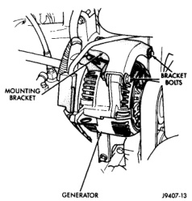
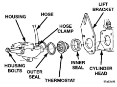
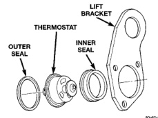

## REMOVAL AND INSTALLATION (Continued)

2. Remove accessory drive belt. Refer to Belt Removal/Installation in the Engine Accessory Drive Belt section in this group.

3. Drain cooling system until coolant level is below thermostat. Refer to Draining Cooling System in this section.

**WARNING: CONSTANT TENSION HOSE CLAMPS ARE USED ON MOST COOLING SYSTEM HOSES. WHEN REMOVING OR INSTALLING, USE ONLY TOOLS DESIGNED FOR SERVICING THIS TYPE OF CLAMP, SUCH AS SPECIAL CLAMP TOOL (NUMBER 6094). SNAP-ON CLAMP TOOL (NUMBER HPC-20) MAY BE USED FOR LARGER CLAMPS. ALWAYS WEAR SAFETY GLASSES WHEN SERVICING CONSTANT TENSION CLAMPS.**

**CAUTION: A number or letter is stamped into the tongue of constant tension clamps. If replacement is necessary, use only an original equipment clamp with a matching number or letter.**

4. Remove radiator hose clamp and hose from thermostat housing. A special clamp tool must be used to remove the constant tension clamps.

5. Remove the hose clamp and check valve hose at thermostat housing (Fig. 74).

*Fig. 74 Thermostat Removal—5.9L Diesel*

6. Remove the two upper generator bracket mounting bolts (Fig. 75).

7. Remove the upper generator mounting bracket (Fig. 75).

8. Loosen but do not remove the generator lower pivot bolt.

9. Position the generator to gain access to thermostat housing and housing bolts.

10. Remove thermostat housing mounting bolts.

11. Remove the thermostat housing, thermostat, inner and outer seals and lift bracket (Fig. 74).

*Fig. 75 Generator Mounting Bracket Bolts—Diesel*

12. Clean the mating surfaces of the thermostat housing and the cylinder head.

#### INSTALLATION

1. Install the outer seal (Fig. 74) (Fig. 76) into the machined shoulder on the thermostat housing.

2. Install the thermostat into the machined shoulder next to the outer seal. Note direction of thermostat in (Fig. 74) (Fig. 76).

3. Position the inner thermostat seal with the shoulder towards the thermostat housing (Fig. 76).

*Fig. 76 Thermostat Seals—5.9L Diesel—Typical*

4. Install thermostat, lift bracket, seals and housing to the engine as an assembly. Install and tighten mounting bolts to 24 N·m (18 ft. lbs.) torque.
