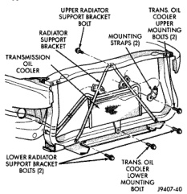

## REMOVAL AND INSTALLATION (Continued)

5. Position generator to thermostat housing. Install and tighten mounting bolt to 24 N·m torque. Tighten pivot bolt to 43 N·m (32 ft. lbs.) torque.

6. Install the check valve hose and hose clamp at thermostat housing (Fig. 74).

7. Install accessory drive belt. Refer to Belt Removal/Installation in the Engine Accessory Drive Belt section of this group.

8. Connect negative battery cables to both batteries.

9. Fill cooling system and check for leaks. Refer to Refilling Cooling System in this group.

### REPLACING WATER-TO-OIL COOLER IN RADIATOR SIDE TANK

The internal transmission oil cooler located within the radiator is not serviceable. If it requires service, the radiator must be replaced.

Once the repaired or replacement radiator has been installed, fill the cooling system and inspect for leaks. Refer to the Refilling Cooling System and Testing Cooling System For Leaks sections in this group. If the transmission operates properly after repairing the leak, drain the transmission and remove the transmission oil pan. Inspect for sludge and/or rust. Inspect for a dirty or plugged inlet filter. If none of these conditions are found, the transmission and torque convertor may not require reconditioning. Refer to Group 21 for automatic transmission servicing.

### AUXILIARY TRANSMISSION OIL COOLER—3.9L/5.2L/5.9L ENGINES

#### REMOVAL

1. Disconnect battery negative cable.

2. Recover refrigerant and remove the a/c condenser (if equipped). Refer to Group 24, Heating and Air Conditioning for the correct procedure.

3. Place a drain pan under the oil cooler lines.

4. Disconnect the auxiliary transmission oil cooler line quick-connect fitting at the cooler outlet using the quick connect release tool 6935. Loosen clamp from inlet connection and slide hose off of nipple. Plug cooler lines to prevent oil leakage.

5. Remove the oil cooler lower mounting bolt (oil cooler-to-vehicle body) (Fig. 77).

6. Remove three bolts (radiator support bracket-to-body). Remove this A-shaped support bracket and the transmission oil cooler as an assembly from the vehicle. Take care not to damage the radiator core or A/C condenser fins with the cooling lines when removing.

7. Remove oil cooler from A-shaped support bracket by removing two upper mounting strap bolts and mounting straps at support bracket (Fig. 77).

8. Remove oil cooler from the A-shaped radiator support bracket.

*Fig. 74 Auxiliary Transmission Oil Cooler—3.9/5.2/5.9L Engines*

*Fig. 77 Auxiliary Transmission Oil Cooler—3.9/5.2/5.9L Engines*

#### INSTALLATION

1. Install the oil cooler assembly to the A-shaped radiator support bracket using the two upper mounting bolts and mounting straps. Install the bolts but do not tighten at this time.

2. Install the radiator support bracket and oil cooler (as an assembly) to the vehicle.

3. Install the two lower radiator A-shaped support bracket bolts. Do not tighten bolts at this time.

4. Slide and position the oil cooler on the A-shaped bracket until its lower mounting hole lines up with the bolt hole on the vehicle body. Tighten the oil cooler mounting strap bolts to 6 N·m (50 in. lbs.) torque.

5. Install the upper radiator A-shaped support bracket bolt. Tighten all three radiator support bracket mounting bolts to 11 N·m (95 in. lbs.) torque.

6. Inspect quick connect fitting for debris and install the quick-connect fitting on the auxiliary cooler outlet tube until an audible "click" is heard. Pull apart to verify connection.

7. Connect battery negative cable.

8. Start the engine and check all fittings for leaks.

9. Check the fluid level in the automatic transmission. Refer to Group 21, Transmissions for procedures.
