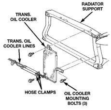
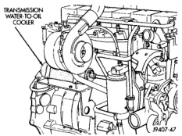

## REMOVAL AND INSTALLATION (Continued)

### AUXILIARY TRANSMISSION OIL COOLER—8.0L ENGINE

#### REMOVAL

1. Place a drain pan under the oil cooler lines.

2. Disconnect the two transmission lines from the oil cooler by loosening the two worm gear clamps and pulling the rubber hoses off of the oil cooler tubes (Fig. 78). Plug all oil cooler lines to prevent oil leakage.

3. Remove three oil cooler-to-radiator support mounting bolts (Fig. 78).

4. Remove the oil cooler and line assembly from the vehicle.

*Fig. 78 Auxiliary Transmission Oil Cooler—8.0L Engine*

#### INSTALLATION

1. Install the oil cooler and cooler line assembly to the vehicle.

2. Install three mounting bolts and tighten to 6 N·m (50 in. lbs.) torque.

3. Connect the transmission cooling lines to the oil cooler by pushing the rubber hoses onto the oil cooler tubes. Tighten the worm gear clamps to 2 N·m (18 in. lbs.)

4. Start the engine and check all fittings for leaks.

5. Check the fluid level in the automatic transmission. Refer to Group 21, Transmissions for procedures.

### WATER-TO-OIL COOLER—5.9L DIESEL ENGINE

#### REMOVAL

**CAUTION: If a leak should occur in the water-to-oil cooler mounted to the side of the engine block, engine coolant may become mixed with transmission fluid. Transmission fluid may also enter engine cooling system. Both cooling system and transmission should be drained and inspected in case of oil cooler leakage.**

1. Disconnect both battery negative cables.

2. Remove air cleaner assembly and air cleaner intake hoses. Refer to Group 14, Fuel System for procedures.

3. Drain cooling system. Refer to Draining Cooling System in this group.

4. Disconnect coolant lines from cooler.

5. Disconnect transmission oil lines from cooler. Plug cooler lines to prevent oil leakage.

6. Remove oil cooler mounting straps (Fig. 79).

7. Lift oil cooler off of mounting bracket.

8. If replacing cooler, make sure to transfer converter drain back valve to new cooler.

*Fig. 79 Transmission Water-To-Oil Cooler—Diesel*

#### INSTALLATION

1. Position oil cooler on bracket.

2. Install mounting straps.

3. Connect transmission oil lines to cooler.

4. Connect coolant hoses to cooler.

5. Connect battery negative cables.

6. Fill cooling system. Refer to Refilling Cooling System in this section.

7. Check transmission oil level and fill as necessary.

8. Install air cleaner assembly and air cleaner intake hoses. Refer to Group 14, Fuel System for procedures.
