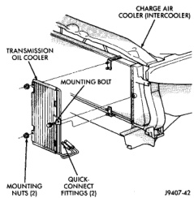

## REMOVAL AND INSTALLATION (Continued)

### AUXILIARY TRANSMISSION OIL COOLER—5.9L DIESEL ENGINE

#### REMOVAL

1. Remove front bumper. Refer to Group 23, Body.

2. Place a drain pan under the oil cooler.

3. Raise the vehicle.

4. Disconnect the oil cooler quick-connect fittings from the transmission lines. These are located near the power steering gearbox. Refer to Group 21, Transmissions for procedures.

5. Remove the charge air cooler-to-oil cooler bolt (Fig. 80).

*Fig. 80 Auxiliary Transmission Oil Cooler—Diesel Engine*

6. Remove two mounting nuts.

7. Remove the oil cooler and line assembly towards the front of vehicle. Cooler must be rotated and tilted into position while removing.

#### INSTALLATION

1. Carefully position the oil cooler assembly to the vehicle.

2. Install two nuts and one bolt. Tighten to 11 N·m (95 in. lbs.) torque.

3. Connect the quick-connect fittings to the transmission cooler lines. Refer to Group 21, Transmissions for procedures.

4. Install front bumper. Refer to Group 23, Body.

5. Start the engine and check all fittings for leaks.

6. Check the fluid level in the automatic transmission. Refer to Group 21, Transmissions for procedures.

### RADIATOR

#### REMOVAL—ALL ENGINES

1. All Engines Except Diesel: Disconnect battery negative cables.

2. Diesel engine: Disconnect both battery negative cables. Remove the nuts retaining the positive cable to the top of radiator. Position positive battery cable to rear of vehicle.

**WARNING: DO NOT REMOVE THE CYLINDER BLOCK DRAIN PLUGS OR LOOSEN THE RADIATOR DRAINCOCK WITH THE SYSTEM HOT AND UNDER PRESSURE. SERIOUS BURNS FROM COOLANT CAN OCCUR.**

3. Drain the cooling system. Refer to Draining Cooling System in this group.

**WARNING: CONSTANT TENSION HOSE CLAMPS ARE USED ON MOST COOLING SYSTEM HOSES. WHEN REMOVING OR INSTALLING, USE ONLY TOOLS DESIGNED FOR SERVICING THIS TYPE OF CLAMP, SUCH AS SPECIAL CLAMP TOOL (NUMBER 6094). SNAP-ON CLAMP TOOL (NUMBER HPC-20) MAY BE USED FOR LARGER CLAMPS. ALWAYS WEAR SAFETY GLASSES WHEN SERVICING CONSTANT TENSION CLAMPS.**

**CAUTION: A number or letter is stamped into the tongue of constant tension clamps. If replacement is necessary, use only an original equipment clamp with a matching number or letter.**

4. Remove hose clamps and hoses from radiator.

5. All engines: Remove coolant reserve/overflow tank hose from radiator filler neck nipple.

6. All engines except 8.0L V-10: Remove the coolant reserve/overflow tank from the fan shroud (pull straight up). The tank slips into T-slots on the fan shroud.

7. Disconnect electrical connectors at windshield washer reservoir tank and remove tank. Refer to Group 8K, Windshield Wiper and Washer Systems for procedures.

8. If equipped with an automatic transmission (all engines except diesel), disconnect oil cooler lines (hoses) at radiator tank, using quick connect fitting release tool 6935 on 3.9/5.2/5.9L models, and tool 6931 on 8.0L models.

9. Diesel Engine Only: Remove the two metal clips retaining the upper part of fan shroud to the top of radiator.
