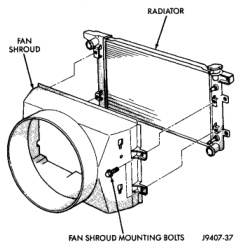
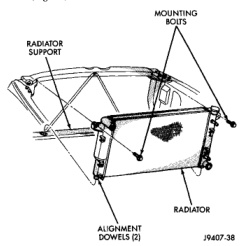

## REMOVAL AND INSTALLATION (Continued)

10. Remove the four fan shroud mounting bolts (Fig. 81). Position shroud rearward over the fan blades towards engine.

*Fig. 81 Typical Fan Shroud Mounting*

11. All Engines Except 8.0L V-10 and Diesel: Remove the plastic clips retaining the rubber shields to the sides of radiator. Position rubber shields to the side.

12. Remove the two radiator upper mounting bolts (Fig. 82).

*Fig. 82 Typical Radiator Mounting*

13. Lift radiator straight up and out of engine compartment. The bottom of the radiator is equipped with two alignment dowels that fit into holes in the lower radiator support panel (Fig. 82). Rubber biscuits (insulators) are installed to these dowels. Take care not to damage cooling fins or tubes on the radiator and air conditioning condenser when removing.

#### INSTALLATION

1. Position fan shroud over the fan blades rearward towards engine.

2. Install rubber insulators to alignment dowels at lower part of radiator.

3. Lower the radiator into position while guiding the two alignment dowels into lower radiator support. Different alignment holes are provided in the lower radiator support for each engine application.

4. Install two upper radiator mounting bolts. Tighten bolts to 11 N·m (95 in. lbs.) torque.

5. 3.9L V-6 or 5.2L/5.9L V-8 Engines: Position the rubber shields to the sides of radiator. Install the plastic clips retaining the rubber shields to the sides of radiator.

6. Connect both radiator hoses. Refer to previous CAUTION and install hose clamps.

7. Connect transmission cooler lines to radiator tank. Inspect quick connect fittings for debris and install until an audible "click" is heard. Pull apart to verify connection.

8. Install windshield washer reservoir tank. Refer to Group 8K.

9. Position fan shroud to flanges on sides of radiator. Install fan shroud mounting bolts (Fig. 81). Tighten bolts to 6 N·m (50 in. lbs.) torque.

10. Diesel Engines: Install metal clips to top of fan shroud.

11. All engines: Install coolant reserve/overflow tank hose to radiator filler neck nipple.

12. All Engines Except 8.0L V-10: Install coolant reserve/overflow tank to fan shroud (fits into T-slots on shroud).

13. Install battery negative cables.

14. Diesel Engine: Install positive battery cable to top of radiator. Tighten radiator-to-battery cable mounting nuts.

15. Position heater controls to **full heat** position.

16. Fill cooling system with coolant. Refer to Refilling Cooling System in this group.

17. Operate engine until it reaches normal temperature. Check cooling system and automatic transmission (if equipped) fluid levels.
