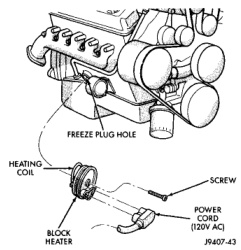
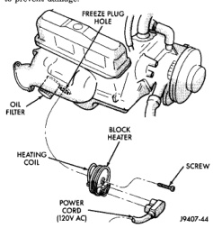
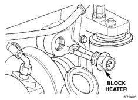

## REMOVAL AND INSTALLATION (Continued)

### BLOCK HEATER—GASOLINE ENGINES

**WARNING: DO NOT REMOVE THE CYLINDER BLOCK DRAIN PLUGS OR LOOSEN THE RADIATOR DRAINCOCK WITH THE SYSTEM HOT AND UNDER PRESSURE. SERIOUS BURNS FROM COOLANT CAN OCCUR.**

#### REMOVAL

1. Disconnect battery negative cable.

2. Drain coolant from radiator and cylinder block.

3. Remove power cord from heater by unplugging (Fig. 83) (Fig. 84).

4. Loosen (but do not completely remove) the screw at center of block heater (Fig. 83) (Fig. 84).

5. Remove block heater by carefully prying from side-to-side. Note direction of heating element coil (up or down). Element coil must be installed correctly to prevent damage.

*Fig. 83 Block Heater—3.9L/5.2L/5.9L Gasoline Engine*

#### INSTALLATION

1. Clean and inspect the block heater hole.

2. Install new O-ring seal(s) to heater in gasoline engines.

3. Insert block heater into cylinder block.

4. With heater fully seated, tighten center screw to 2 N·m (17 in. lbs.).

5. Fill cooling system with recommended coolant. Refer to Refilling Cooling System section in this group.

6. Start and warm the engine.

7. Check block heater for leaks.

*Fig. 84 Block Heater—8.0L V-10 Engine*

### BLOCK HEATER—DIESEL ENGINE

**WARNING: DO NOT REMOVE THE CYLINDER BLOCK DRAIN PLUGS OR LOOSEN THE RADIATOR DRAINCOCK WITH THE SYSTEM HOT AND UNDER PRESSURE. SERIOUS BURNS FROM COOLANT CAN OCCUR.**

#### REMOVAL

1. Disconnect negative battery cable(s) from battery(s).

2. Drain coolant from radiator and cylinder block.

3. Unscrew the power cord retaining cap and disconnect cord from heater element.

4. Using a suitable size socket, loosen and remove the block heater element (Fig. 85).

*Fig. 85 Block Heater—Diesel Engine*
