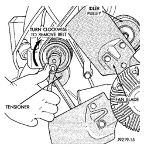

## REMOVAL AND INSTALLATION (Continued)

#### INSTALLATION

1. Clean and inspect the threads in the cylinder block.

2. Coat heater element threads with Mopar Thread Sealer with Teflon.

3. Screw block heater into cylinder block and tighten to 43 N·m (32 ft. lbs.).

4. Connect block heater cord and tighten retaining cap.

5. Fill cooling system with recommended coolant. Refer to Refilling Cooling System section in this group.

6. Start and warm the engine.

7. Check block heater for leaks.

### ACCESSORY DRIVE BELTS

**NOTE: The belt routing schematics are published from the latest information available at the time of publication. If anything differs between these schematics and the Belt Routing Label, use the schematics on Belt Routing Label. This label is located in the engine compartment.**

**CAUTION: Do not attempt to check belt tension with a belt tension gauge on vehicles equipped with an automatic belt tensioner. Refer to Automatic Belt Tensioner in this group.**

#### 3.9L V-6 OR 5.2/5.9L V-8 LDC-GAS ENGINES

##### REMOVAL

Drive belts on these engines are equipped with a spring loaded automatic belt tensioner (Fig. 86). This belt tensioner will be used on all belt configurations, such as with or without power steering or air conditioning. For more information, refer to Automatic Belt Tensioner, proceeding in this group.

1. Attach a socket/wrench to pulley mounting bolt of automatic tensioner (Fig. 86).

2. Rotate tensioner assembly clockwise (as viewed from front) until tension has been relieved from belt.

3. Remove belt from idler pulley first.

4. Remove belt from vehicle.

**CAUTION: When installing the accessory drive belt, the belt must be routed correctly. If not, engine may overheat due to water pump rotating in wrong direction. Refer to (Fig. 87) for correct engine belt routing. The correct belt with correct length must be used.**

*Fig. 86 Belt Tensioner—3.9L V-6 or 5.2/5.9L V-8 LDC-Gas Engines*

##### INSTALLATION

1. Position drive belt over all pulleys **except** idler pulley. This pulley is located between generator and A/C compressor.

2. Attach a socket/wrench to pulley mounting bolt of automatic tensioner (Fig. 86).

3. Rotate socket/wrench clockwise. Place belt over idler pulley. Let tensioner rotate back into place. Remove wrench. Be sure belt is properly seated on all pulleys.

4. Check belt indexing marks. Refer to the proceeding Automatic Belt Tensioner for more belt information.

#### 5.9L HDC-GAS AND 8.0L V-10 ENGINES

##### REMOVAL

Drive belts are equipped with a spring loaded automatic belt tensioner (Fig. 88). This belt tensioner will be used on all belt configurations, such as with or without power steering or air conditioning. For more information, refer to Automatic Belt Tensioner, proceeding in this group.

1. Attach a socket/wrench to pulley mounting bolt of automatic tensioner (Fig. 88). The threads on the pulley mounting bolt are left-hand.

2. Relax the tension from the belt by rotating the tensioner counterclockwise (as viewed from front) (Fig. 88). When all belt tension has been relaxed, remove belt from tensioner pulley first and other pulleys last.
